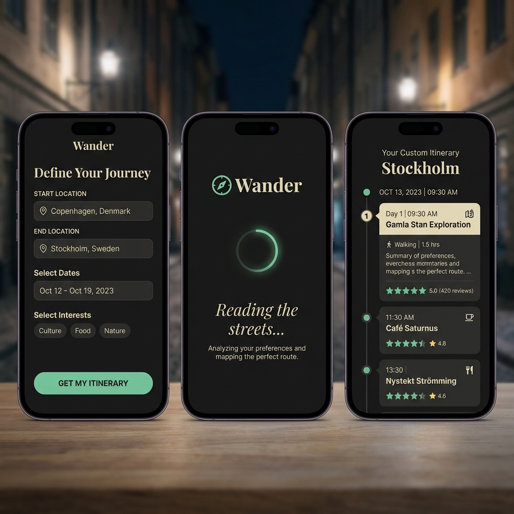

# Wander


> *Your life isn't a chore; wander.*

An AI-powered urban itinerary generator that turns any two addresses into three distinct, navigation-ready walking routes — in under 20 seconds. Built for people who want to actually experience their city, not just survive it.

---

## What It Does



You give Wander a starting point, a destination, a time budget, and a vibe. It fires a radar sweep across Google Places, pulls real, verified venues near your corridor, and hands that context to GPT-4o. The model curates — never invents — three uniquely themed routes from the real-world data. Every walking time is validated by Google Directions. Every stop has a live Google rating. One tap hands the whole thing off to Google Maps for turn-by-turn GPS navigation.

---

## Tech Stack

| Layer | Technology |
|---|---|
| **Frontend** | Next.js 16 (App Router, TypeScript, Tailwind CSS v4) |
| **Animations** | Framer Motion v12 |
| **Backend** | FastAPI (Python 3.13, Uvicorn) |
| **AI Brain** | OpenAI GPT-4o — Structured Outputs |
| **Venue Radar** | Google Places API (New) |
| **Geocoding** | Google Geocoding API |
| **Walk Times** | Google Directions API (walking mode) |
| **Tracing** | LangSmith |
| **Live Enrichment** | Tavily Search |

---

## V3 Architecture — RAG-Powered, Hallucination-Free

The fundamental difference between Wander V3 and any other AI itinerary app:

```
Standard AI Travel App         Wander V3
──────────────────────         ─────────────────────────────────
GPT-4o invents places   →      Google Places finds REAL venues
No validation           →      Every stop has a Google rating
AI guesses walk times   →      Directions API computes real minutes
One generic route       →      3 distinct routes, one click to navigate
```

### The Pipeline

```
User Request (start, end, time, vibe)
    │
    ├─ 1. Geocode start → lat/lng (Geocoding API)
    │
    ├─ 2. Radar sweep: 5 parallel Places searches → 15-20 real venues
    │         Caffeinated & Cultured → coffee roasters, galleries, jazz bars
    │         Green & Scenic         → parks, waterfront paths, gardens
    │         Spontaneous & Social   → rooftop bars, food halls, live music
    │
    ├─ 3. RAG context injection → GPT-4o selects from the verified list
    │         Route 1: Ultra-scenic / relaxed
    │         Route 2: Culturally dense
    │         Route 3: Fast & focused
    │
    ├─ 4. Directions API → real walking minutes between every stop
    │
    ├─ 5. Build Google Maps deep links (URL-encoded, pipe-separated waypoints)
    │
    └─ WanderV3Response → 3 routes, google_rating on every stop, ready to navigate
```

## Prerequisites

You must have the following installed locally:
- Python 3.13+
- Node.js 18+ (for Next.js 16 compatibility)
- A package manager (npm, pnpm, yarn)

---

## Running Locally

### Backend
```bash
cd wander-api
venv\Scripts\activate          # Windows
pip install -r requirements.txt
uvicorn main:app --reload --port 8000
```

### Frontend
```bash
cd wander-ui
npm install
npm run dev
```

App at **http://localhost:3000** — the Next.js config proxies `/api/*` → `localhost:8000`.

---

## Environment Variables

Create `wander-api/.env`:

```env
OPENAI_API_KEY="sk-..."

# LangSmith tracing
LANGCHAIN_TRACING_V2="true"
LANGCHAIN_API_KEY="lsv2_..."

# Google Maps Platform
# Enable: Places API (New), Geocoding API, Directions API
GOOGLE_MAPS_API_KEY="AIza..."

# Tavily live web enrichment
TAVILY_API_KEY="tvly-..."
```

---

## Testing

```bash
# Verify all three Google APIs are live
wander-api\venv\Scripts\python test_google_apis.py

# Full V3 backend integration test
wander-api\venv\Scripts\python test_v3.py
```

**test_v3.py** asserts:
- ✅ Exactly 3 routes returned
- ✅ Every route has a valid Google Maps walking deep link
- ✅ `google_rating` present on all RAG-sourced stops
- ✅ Real `walk_to_next_mins` from Directions API between every stop

---

## Project Structure

```
wander/
├── wander-api/               # FastAPI backend
│   ├── main.py               # V3 RAG pipeline
│   ├── requirements.txt
│   └── .env                  # API keys (not committed)
│
├── wander-ui/                # Next.js frontend
│   ├── app/
│   │   ├── globals.css       # Tailwind v4 design tokens
│   │   ├── layout.tsx        # Playfair Display + Inter fonts
│   │   └── page.tsx          # 3-screen app (Input → Loading → Route)
│   ├── next.config.ts        # API proxy rewrite
│   └── README.md             # Frontend-specific docs + screenshots
│
├── assets/                   # App screenshots
├── TODO_V2.md                # V2 checklist (complete)
├── TODO_V3.md                # V3 checklist (complete)
├── test_google_apis.py       # Google API verification
├── test_v3.py                # V3 integration test
└── README.md                 # This file
```

---

## Design System

**Theme:** *Quiet Luxury / Digital Oasis* — the exact opposite of Google Maps.

| Token | Value | Use |
|---|---|---|
| Obsidian | `#131316` | Page background |
| Surface | `#1E1E24` | Glassmorphism cards |
| Matcha | `#8BA88E` | Primary accent, active states, CTAs |
| Sand | `#E5D3B3` | Time labels, ratings, insider tips |
| Cream | `#F4F4F5` | Body text |

Typography: **Playfair Display** (serif, headings) + **Inter** (sans, body).

---

## API Reference

### `POST /api/generate-route`

```json
{
  "start_location": "Hell's Kitchen, NYC",
  "end_location": "Flatiron District, NYC",
  "time_budget_minutes": 120,
  "vibe": "Green & Scenic"
}
```

**Response shape:**
```json
{
  "routes": [
    {
      "route_name": "Riverside Reverie",
      "theme_summary": "Ultra-scenic waterfront arc with maximum green space.",
      "total_walking_time_mins": 115,
      "navigation_deep_link": "https://www.google.com/maps/dir/?api=1&origin=...&travelmode=walking",
      "waypoints": [
        {
          "order": 1,
          "location_name": "Hudson River Park",
          "address_hint": "Pier 84, W 44th St & 12th Ave, New York, NY",
          "google_rating": 4.6,
          "action_description": "...",
          "duration_mins": 20,
          "walk_to_next_mins": 12,
          "vibe_tag": "Waterfront Walk",
          "insider_tip": "..."
        }
      ]
    }
  ]
}
```

---

## The Handoff — Google Maps Navigation

Tap **Start Wandering** and the native Google Maps app opens with the full multi-stop walking tour pre-loaded. No copy-pasting addresses. No manual entry. One tap.


*The deep link transitions the curated itinerary directly from the Wander UI to the native Google Maps navigation.*

The deep link is built server-side in `build_maps_deep_link()` with URL-encoded, pipe-separated waypoints. Works identically in the native Google Maps iOS/Android app.

---

## Changelog


| Version | Highlights |
|---|---|
| **V3** | RAG pipeline — Google Places radar, hallucination-free stops, real Directions walk times, `google_rating` trust badges |
| **V2** | 3-route generation, Framer Motion carousel, walk-time labels, sticky Google Maps deep-link button |
| **V1** | Single-route generation, GPT-4o structured output, LangSmith tracing, Tavily enrichment |

---

## License

This project is licensed under the MIT License - see the LICENSE file for details.

