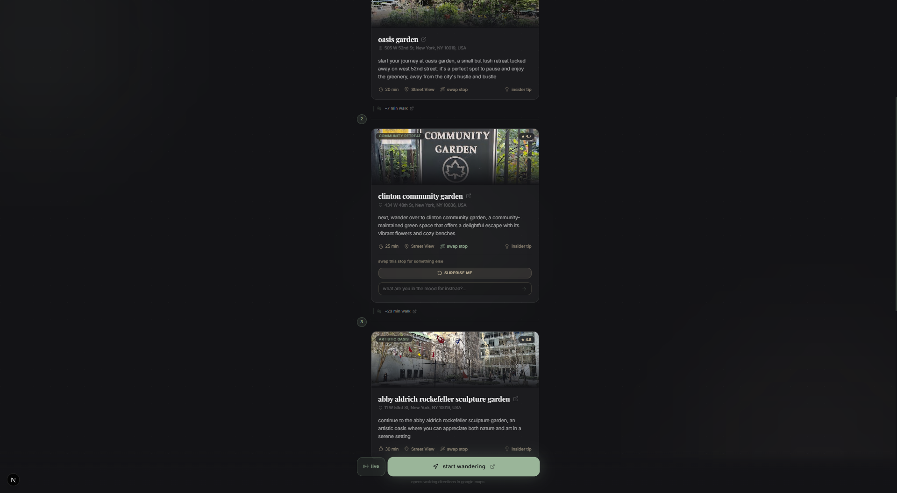
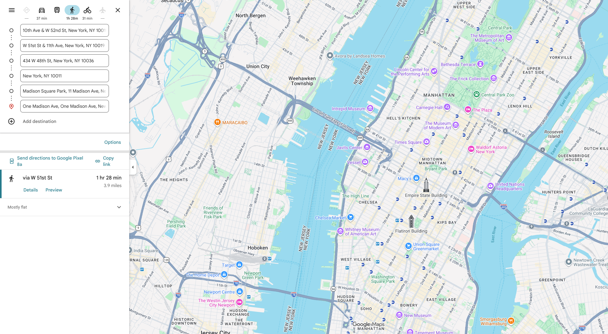
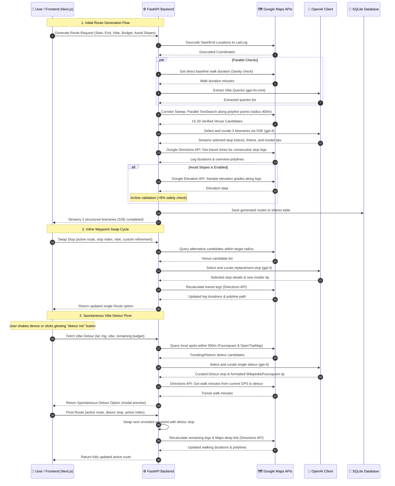

# wander


> *Your life isn't a chore; wander.*

A multi-stop walking route planner that generates three distinct themed itineraries between a starting and ending coordinate. Designed for local navigation, wander queries location APIs to construct structured paths with detailed venue metadata.

---

## How It Works

wander accepts starting and destination parameters to dynamically structure walking tours.

**1. Configure parameters**: Enter your starting location and destination (or select round-trip to lock them), vibe profile, stop count (from 2 to 5), time budget, **maximum per-person budget**, and **steep slope avoidance toggle**. An inline pacing advisor validates if target parameters match physical walking geometry.

<div align="center">
  
</div>

<br/>

**2. Stream and compare three routes**: The application queries the Google Directions API to fetch the baseline direct path, decodes the polyline, dynamically samples 2-5 intermediate center coordinates based on the route distance (1 point per 800m), and runs tight parallel Google Places sweeps (400m radius restriction). The engine then streams three distinct themed walking itineraries:
* **Route 1 (Scenic and Relaxed)**: Prioritizes parks, waterfront paths, and low-traffic streets.
* **Route 2 (Culturally Dense)**: Integrates bookstores, art galleries, and historic landmarks.
* **Route 3 (Social and Lively)**: Incorporates cafes, food halls, local vendors, and bars.

<div align="center">
  
</div>

<br/>

**3. Fine-tune your stops**: To modify a specific stop, click **swap stop** on its card. The planner supports a "Surprise Me" replacement matching the active vibe, or a custom text requirement (such as "bakery instead of coffee"), while respecting your remaining budget limit. The backend queries candidate venues, invokes GPT-4o to select and curate the node, and recalculates walking leg durations, map coordinates, and navigation links.

<div align="center">
  
</div>

<br/>

**4. Start navigation**: Clicking **Start Wandering** opens a Google Maps walking directions link pre-populated with Place IDs. Itineraries can also be downloaded as `.ics` calendar events. Alternatively, activate **Live Walk Mode** inside the app for real-time proximity stamps and shake-to-trigger **Spontaneous Vibe Detours**.

<div align="center">
  
</div>

---

## System Sequence Flow

The following sequence diagram tracks the lifecycle of user actions, route generation, inline stop swapping, and spontaneous detour pivots:



---

## Key Features

### 1. RAG & Intelligent Routing (Core Engine)
* **Verified Google Places Data**: Sourced directly from the Google Places API (New) to prevent venue hallucinations.
* **Weather-Aware Curation**: Auto-pivots to indoor spaces (museums, covered markets, libraries) when weather API detects active precipitation.
* **Daypart Transitioning**: Sequences stop categories logically by time of day (e.g. prioritizing coffee in the morning and local bars/jazz clubs in the evening).
* **Feeling Lucky Vibe**: A surprise theme selector that constructs itineraries with speakeasies, oddities museums, and architectural landmarks.
* **Round-Trip Geometry Sync**: Locks destination coordinates to the starting location to generate circular walking loops.

### 2. Active Navigation & Walk Mode
* **Live GPS Walk Mode**: Real-time position tracking that highlights active timeline cards when within 150 meters of a waypoint and auto-advances stop durations.
* **Spontaneous "Vibe Detours"**: Tap the glowing detour controller or shake your phone to discover and pivot to trending local spots (vintage records, matcha cafes, historic views) within 500m.

### 3. Pacing, Safety & Constraints
* **Accessibility (Incline Grade Safety)**: Samples elevations along walking leg polylines using the Google Elevation API to detect and filter out routes with steep slopes (>8% grade).
* **Budget Limits & Cost Estimation**: Filters waypoints to adhere to per-person budget limits and provides real-time spend estimations per stop.
* **Walk & Dwell Breakdown Indicators**: Splits route timelines into clear transit walking vs. stop dwell duration pills (e.g. `🚶 X min walking` and `☕ Y min at stops`).

### 4. Customization & Gamification
* **Dynamic Waypoint Swapping**: Replace individual stops inline. Queries local candidates and uses GPT-4o to rewrite descriptions and recalculate leg geometries.
* **Neighborhood Passport**: Gamified database logging of visited neighborhoods, vibe profiles, and completed stops to update user passport progress.

### 5. Portability & Synchronization
* **Add to Calendar (ICS)**: Downloads calendar events preloaded with stop coordinates, ratings, stay durations, and navigation links.
* **Shareable Routes**: Persists generated itineraries with short links (`/r/abc123`) for cross-user synchronization.
* **PWA Installable**: Supports Progressive Web App deployment on iOS/Android for a full-screen, app-like experience.


---

## Tech Stack

| Layer | Technology | Description |
|---|---|---|
| **Frontend** | Next.js 16 (App Router, TypeScript) | Obsidian black (#131316) and matcha green (#8BA88E) interface. |
| **Styling and Animations** | Tailwind CSS v4, Framer Motion v12 | Glassmorphism cards, fluid transitions, staggered timeline loading. |
| **Backend** | FastAPI (Python 3.13, Uvicorn) | High-performance Python backend serving SSE streams. |
| **Persistence** | SQLite3 | Shareable route links (/r/[id]). |
| **AI Processing** | OpenAI GPT-4o and GPT-4o-mini | Structured JSON outputs for route curation and keyword extraction. |
| **Geocoding** | Google Geocoding API | Converts natural language addresses to lat/lng coordinates. |
| **Venue Search** | Google Places API (New) | Parallel radar queries centered along the route corridor. |
| **Walking Feasibility** | Google Directions API | Real road-network walking durations between every stop. |
| **Elevation Mapping** | Google Elevation API | Incline/slope checking along route leg polylines. |
| **Spontaneous Commercial** | Foursquare Places API | Search for commercial detours (matcha, records, dessert) within 500m. |
| **Spontaneous Cultural** | OpenTripMap API | Search for public art, historic sites, and scenic overlooks within 500m. |
| **Weather** | OpenWeatherMap API | Live weather retrieval for weather-aware routing. |

---

## System Architecture

wander enforces a strict, multi-stage pipeline to generate walking tours:

```
User Request (start, end, time_budget, vibe, local_time)
    │
    ├─ 1. Geocode Start & End coordinates (Geocoding API)
    │
    ├─ 2. Fetch current weather conditions (OpenWeatherMap API)
    │
    ├─ 3. Keyword Extraction (GPT-4o-mini)
    │      Extracts Maps search queries from the user's custom vibe text.
    │
    ├─ 4. Corridor Radar Sweep (Places API New)
    │      5 parallel searches centered along the route path ->
    │      15-20 verified venue candidates.
    │
    ├─ 5. Sequential Route Generation (GPT-4o)
    │      Streams 3 distinct themed routes via SSE.
    │      Venues used in Route 1 are excluded from Routes 2 & 3.
    │
    ├─ 6. Walking Validation (Directions API)
    │      Validates real road-network walking time between every stop.
    │
    ├─ 7. Persistence (SQLite3)
    │      Stores route data for permanent shareable links.
    │
    └─ Response streamed -> Timeline, Ratings, Map Polyline, Deep Link, ICS
```
---

## AI and LLM Prompts & Curation

`wander` serves as a prime demonstration of how to integrate AI and LLMs dynamically into a production software system. Instead of using loose text formatting or plain generation prompts, the application uses **Structured Output Pydantic schemas**, **contextual prompt chunking**, and **strict RAG constraints** to ensure output reproducibility and zero-hallucination execution.

All prompt templates are defined directly in the backend code. Below are the key prompts with direct links to the codebase:

### 1. Vibe Query Keyword Extractor (GPT-4o-mini)
* **Code Link**: [wander-api/main.py#L341-L354](wander-api/main.py#L341-L354)
* **Model**: `gpt-4o-mini` (low latency, high classification accuracy)
* **Goal**: Parses natural language vibe text descriptions into structured Google Places search queries.
* **System Prompt**:
```
You are an assistant that extracts specific Google Maps Places search terms from a descriptive vibe. Extract 3 to 5 distinct, concrete, search queries (e.g. 'bookstore', 'ramen', 'rooftop bar') matching the user's desires. Return ONLY a JSON object containing a 'queries' array of strings. Example: {'queries': ['query1', 'query2']}.
```

### 2. Feeling Lucky surprise generator (GPT-4o-mini)
* **Code Link**: [wander-api/main.py#L374-L392](wander-api/main.py#L374-L392)
* **Model**: `gpt-4o-mini`
* **Goal**: Generates a quirky, surprising themed set of queries when the user chooses "Feeling Lucky".
* **System Prompt**:
```
You are an urban exploration planner. The user clicked 'I'm Feeling Lucky'. Create a cohesive but completely unexpected, quirky, and themed set of 3 to 5 Google Maps search queries. Think of strange but delightful themes: a retro neon crawl, a botanical & vintage book drift, a speakeasy & historic mystery walk, or a vinyl record & coffee alleyway stroll. Be creative and specific with the search queries (e.g. 'independent bookstore', 'retro arcade bar', 'historic fountain overlook'). Return ONLY a JSON object containing a 'queries' array of strings. Example: {'queries': ['query1', 'query2', 'query3']}.
```

### 3. Route Generator & Curator (GPT-4o)
* **Code Link**: [wander-api/main.py#L905-L1087](wander-api/main.py#L905-L1087)
* **Model**: `gpt-4o` (for complex RAG reasoning, time partitioning, and geographic constraints)
* **Goal**: Selects the sequence of stops from the verified radar sweep results and curates the timeline.
* **Prompt Architecture**:
  * **RAG Context**: Fed a strict numbered list of verified places (lat/lng, address, ratings, progression index).
  * **Dynamic Chunks**: Appends weather pivots (e.g., rain/snow locks outdoor spaces), daypart partitioning (no coffee shops at 8 PM), companion guidelines (date, friends, pet, solo), and budget constraints.
  * **Strict Constraints**: 1. Zero Invented Stops. 2. strictly increasing index order (no backtracking). 3. Time budget compliance.
  * **Pydantic Validation Schema**: Evaluates route details directly into `DynamicRouteOptionLLM` with fields for `route_name`, `theme_summary`, and waypoint arrays.

### 4. Stop Swapping Replacement Curator (GPT-4o)
* **Code Link**: [wander-api/main.py#L1854-L1920](wander-api/main.py#L1854-L1920)
* **Model**: `gpt-4o`
* **Goal**: Selects and curates a replacement stop when a user rejects a specific waypoint.
* **Prompt Details**: Recalls the active route name, other stops, target swap target, any custom user refinement (e.g. "bakery instead of coffee"), remaining budget, and the alternative candidates list. Forces logistic compatibility (cannot backtrack between target index - 1 and target index + 1).

### 5. Spontaneous Detour Curation (GPT-4o)
* **Code Link**: [wander-api/main.py#L1925-L1965](wander-api/main.py#L1925-L1965)
* **Model**: `gpt-4o`
* **Goal**: Chooses the single best spontaneous local detour from Foursquare (commercial) or OpenTripMap (cultural) candidates when walking.

---

## Running Locally

### Step 0: Environment Configuration

Before running any installation or execution commands, duplicate the environment configuration template file `wander-api/.env.example` into a local `wander-api/.env` file and populate all variables with your active API keys:

```bash
cp wander-api/.env.example wander-api/.env
```

Ensure that all required variables (`OPENAI_API_KEY`, `GOOGLE_MAPS_API_KEY`, and `OPENWEATHER_API_KEY`) are populated prior to startup.

### Prerequisites
* Node.js 18+ & npm
* Python 3.13+

### Backend
```bash
cd wander-api
python -m venv venv
venv\Scripts\activate          # Windows
source venv/bin/activate       # macOS/Linux
pip install -r requirements.txt
uvicorn main:app --reload --port 8000
```

### Frontend
```bash
cd wander-ui
npm install
npm run dev
```

Visit **http://localhost:3000**. The Next.js dev server proxies `/api/*` to FastAPI at `localhost:8000`.

---

## Verification and Testing

```bash
# Verify integrity of Google API credentials
wander-api\venv\Scripts\python test_google_apis.py

# Full backend integration and retrieval-augmented generation test suite
wander-api\venv\Scripts\python test_v3.py
```

Asserts:
* Exactly 3 distinct routes generated.
* Every route has a valid Google Maps walking deep link.
* `google_rating` present on all RAG-sourced stops.
* Real `walk_to_next_mins` from Directions API between every stop.
* Time budgets respect walking and dwell constraints.

---

## Project Layout

```
wander/
230: ├── wander-api/
231: │   ├── main.py               # Route generation pipeline, constraints, SSE streaming
232: │   ├── database.py           # SQLite persistence for shared routes
233: │   ├── requirements.txt
234: │   └── .env                  # API keys (never committed)
235: │
236: ├── wander-ui/
237: │   ├── app/
238: │   │   ├── components/
239: │   │   │   └── MapPreview.tsx      # Google Maps embed with route polyline
240: │   │   ├── hooks/
241: │   │   │   ├── useWalkMode.ts      # Live GPS walk mode, proximity detection
242: │   │   │   └── usePassport.ts      # Neighborhood passport (localStorage)
243: │   │   ├── r/[id]/page.tsx         # Shareable route renderer
244: │   │   ├── globals.css             # Design tokens, animation utilities
245: │   │   ├── layout.tsx              # Inter + Playfair Display fonts
246: │   │   └── page.tsx                # Main app: inputs, routes, timeline, calendar
247: │   ├── public/
248: │   │   ├── manifest.json           # PWA manifest
249: │   │   └── sw.js                   # Service worker cache
250: │   └── next.config.ts              # /api/* proxy → localhost:8000
251: │
252: ├── assets/                         # App screenshots
253: └── README.md
```

---

## License

MIT
