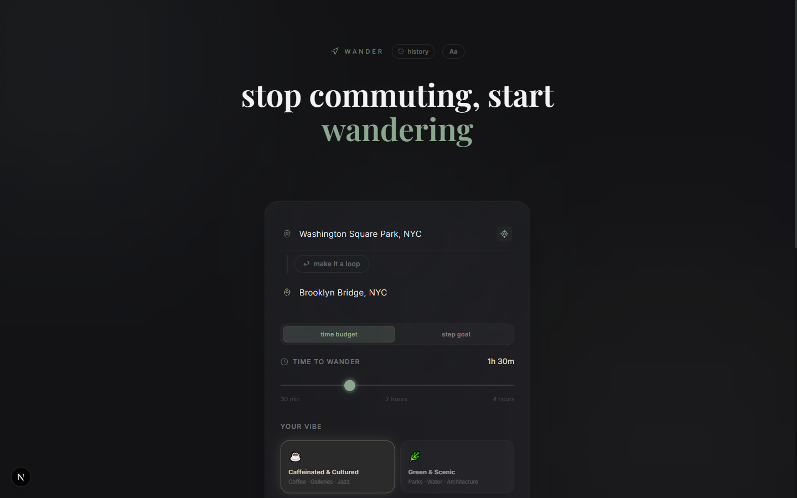
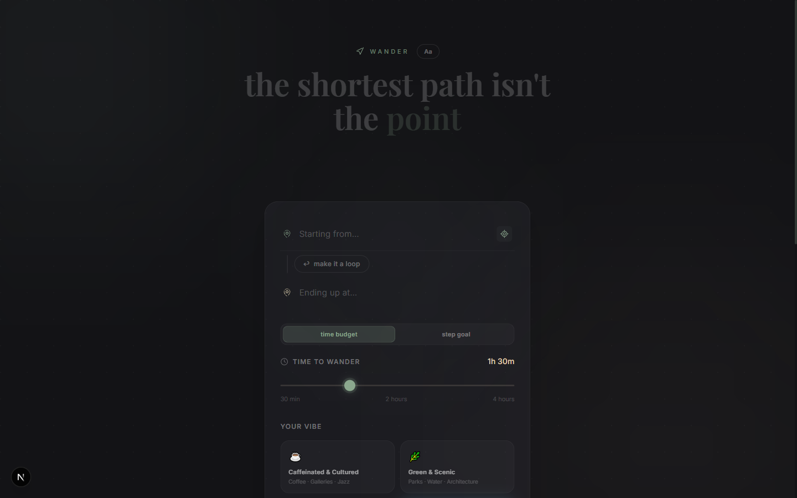
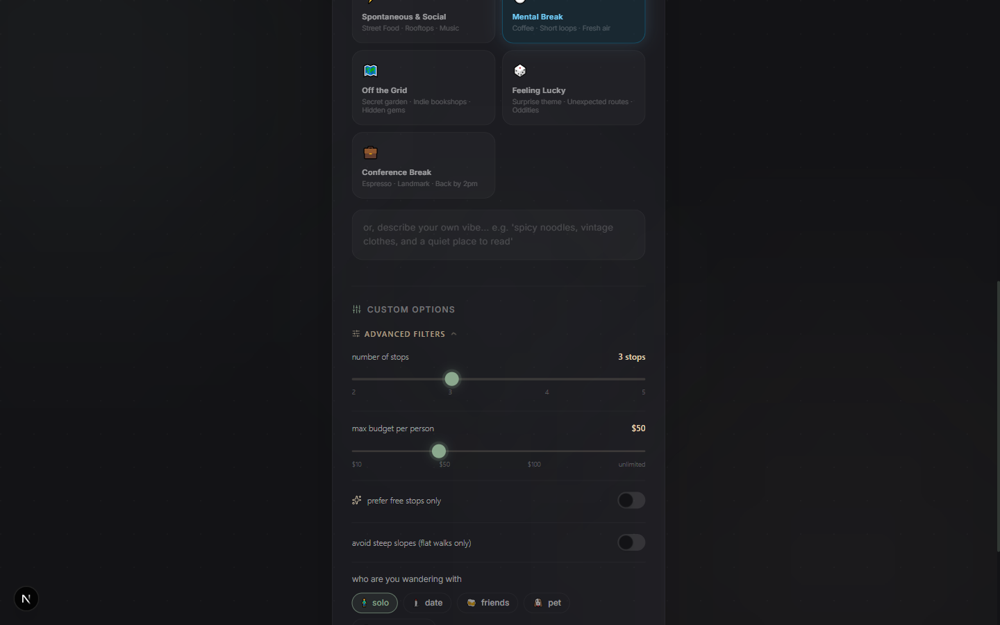
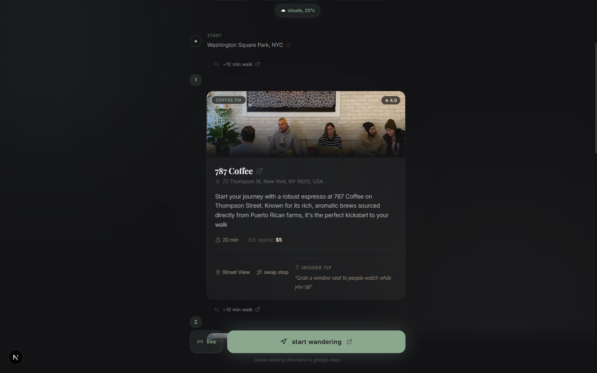
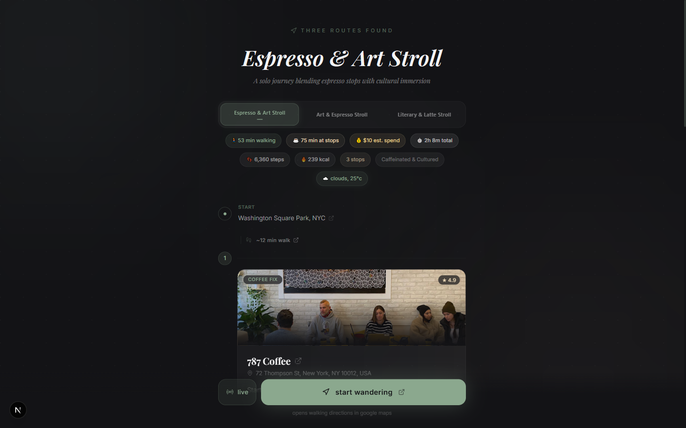
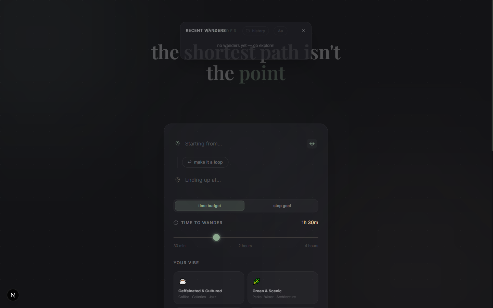
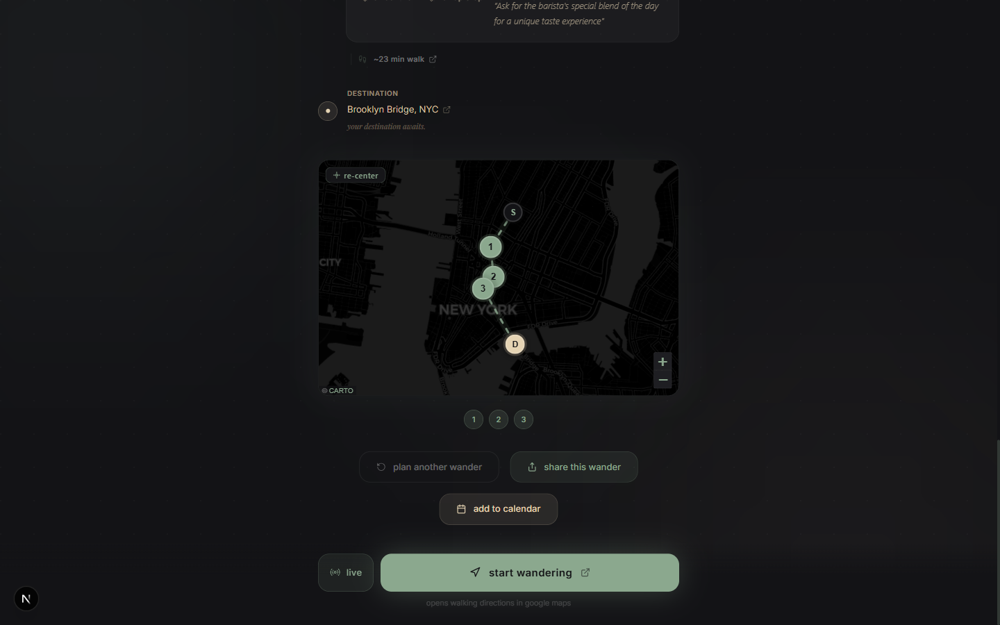

# wander 🗺️

> *the shortest path isn't the point.*

An AI-powered urban walking itinerary generator. Give it a start, an end, a time budget, and a vibe — it streams three distinct curated routes back to you in real time, complete with venue photos, insider tips, a real walking-route map, live walk mode, and a spontaneous detour button for when the plan should change.

---

## Screenshots

### Home — Smart Input Form

The main input screen with hero tagline, start/end location fields with GPS locate button, and the **history** button to revisit past wanders.



### Pick Your Vibe

Choose from 7 curated vibes — or type your own in plain English. Conference Break and Feeling Lucky generate their own themed route archetypes on the fly.



### Advanced Filters

Stop count, max budget per person, free-stops-only toggle, slope avoidance, and companion selector — all tucked behind a collapsible accordion so the form stays clean.



### Dynamic Trivia Loading Screen

While GPT-4o builds your routes, the backend fires a concurrent `gpt-4o-mini` call to fetch obscure facts about your starting location. They stream in as `did you know:` SSE events — fading in with AnimatePresence as the route generates.


### Three Routes, Streaming In

Routes stream via SSE the moment each one finishes. The first tab auto-selects and the page transitions immediately — tabs 2 and 3 show shimmer skeletons while they load.

Each route gets its own vibe-specific archetype name, with metadata badges for walk time, stop time, estimated spend, step count, calories, and live weather.



### Real Walking-Route Map

A CARTO dark-mode Leaflet map now draws the **actual street-following route polyline** from Google Directions — no more dashed straight lines. Stop markers are numbered, destination pulses. Tap any marker for a popup with directions, Street View, and the stop summary.


### Waypoint Cards with Thumbs Rating

Every stop has a Google Places photo, star rating, vibe-category pill, description, time estimate, cost, street view link, and a permanently visible **Insider Tip**. You can also rate any stop thumbs up/down right on the card — or swap it for something better.



### Wander History

Hit the **history** button in the header to see your last 10 wanders — route names, start/end, vibe, and date. Past ratings are preserved.



### Spontaneous Detour

Mid-walk, tap the **detour me** button. The AI surfaces a nearby off-route gem with its own insider tip. Choose to keep walking or **pivot route** — which rebuilds the remaining itinerary around the detour stop.



---

## How It Works

```
User fills form  →  POST /api/generate-route (5/min rate limit)
                          │
                    SSE stream opens
                          │
             ┌────────────┼────────────────────┐
             │            │                    │
       trivia_task   geocode + weather    venue search
     (gpt-4o-mini)   (Google APIs)      (Places API)
             │            │                    │
             └────────────┴─► "did you know: …" status events
                          │
                   3 parallel async LLM calls (gpt-4o)
                   each routed to a unique archetype
                          │
              route 1 done → SSE → frontend shows tab 1
              route 2 done → SSE → tab 2 unlocks
              route 3 done → SSE → tab 3 unlocks + 🎉 confetti
              done event  → history saved + feedback modal
```

1. **Configure** — Enter start + end (or loop), time budget (30 min–4 hr) or step goal, pick a vibe or write your own. Advanced filters let you set stop count, max budget, free-stops preference, slope avoidance, and companion.

2. **Trivia streams** — A fast `gpt-4o-mini` call fires immediately and streams 3 obscure location facts as `did you know:` status events while your routes are being built. No staring at a spinner.

3. **Three routes stream in** — `gpt-4o` generates 3 route archetypes in parallel using a RAG pipeline over Google Places venue data. Each route arrives as soon as it's ready; the first tab auto-selects and confetti fires when the last one lands.

4. **Walk it** — Hit **live** to start GPS-tracked Walk Mode. Stops glow when you're within 150m; dwell for 5 minutes inside 100m and they auto-check-in. Or tap **start wandering** to open Google Maps walking directions.

5. **Pivot anytime** — The **detour me** button surfaces a nearby gem with an insider tip. Keep walking or pivot the rest of your route around it.

6. **Rate your stops** — After your walk, a feedback modal lets you thumbs up/down each stop. Ratings are stored locally (wander history) and sent to the backend for future learning.

---

## Features

### Route Generation
| Feature | Detail |
|---|---|
| **Real-time SSE streaming** | Routes arrive as each finishes — no waiting for all 3 |
| **AsyncOpenAI** | All 3 parallel LLM calls use `AsyncOpenAI` — true async I/O, no thread pool |
| **3 parallel route archetypes** | Vibe-specific themes (e.g. Mental Break → "Serene Sunday Stroll", "Urban Zen Stroll") |
| **Venue RAG pipeline** | Up to 25 top-rated, geographically-sorted candidates fed to LLM |
| **Feasibility guard** | Pacing advisor rejects impossible budgets before generation |
| **Round-trip / loop support** | `make it a loop` locks start = end with adjusted radius |
| **Step goal mode** | Alternative to time budget — enter a daily step target |
| **Geometry validation** | Routes that would require >85% of budget just walking are rejected |
| **Rate limiting** | 5 req/min on generate, 10/min on swap and detour (slowapi) |

### Vibes
| Vibe | Route Archetypes |
|---|---|
| ☕ Caffeinated & Cultured | Espresso Circuit · Gallery Drift · Literary Stroll |
| 🌿 Green & Scenic | River & Park Loop · Quiet Garden Walk · Waterfront Wander |
| 🌙 After Dark | Late-Night Social · Hidden Bar Crawl · Night Owl Circuit |
| 🌇 Golden Hour | Sunset Viewpoints · Golden Hour Drift · Dusk Urban Walk |
| 🎨 Off the Grid | Secret Alleyways · Indie Bookshop Crawl · Hidden Gems |
| 🧘 Mental Break | Serene Sunday Stroll · Serenity Stroll · Urban Zen Stroll |
| 💼 Conference Break | Quick Espresso Sprint · Landmark Refresh · Back-by-2pm Loop |
| 🎲 Feeling Lucky | AI-generated surprise theme each time |

### Live Walk Mode
- **GPS proximity glow** — stop cards ring and pulse when you're within 150m
- **Dwell auto check-in** — 5 minutes inside 100m triggers automatic completion
- **Manual check-in** — tap any stop to mark it visited
- **Remaining time estimate** — recalculates dynamically as you check stops off
- **Stops-without-GPS warning** — flags stops that can't auto-glow

### Real Walking-Route Map
- **Street-following polyline** — Google Directions decodes the actual walking path; route_polyline is decoded and sent to the frontend
- **Fallback** — if Directions API has no polyline, dashed straight-line between pins
- **Rich popups** — click any pin for open-in-maps, street view, rating, and address
- **Re-center button** — tap to snap map back to route bounds

### Waypoint Cards
- Google Places photo banner (lazy-loaded, graceful fallback)
- Star rating + vibe-category pill
- AI-written description tailored to your companion and vibe
- Duration estimate + estimated spend
- **Insider Tip** — always visible, concierge-style local knowledge
- **Swap Stop** — replace with "surprise me" or custom refinement text ("something with a rooftop")
- **Thumbs up/down rating** — instant visual feedback, saved locally + sent to backend
- Street View deep-link

### User History
- **Recent wanders panel** — last 10 wanders stored in `localStorage`
- **Route details** — name, start/end, vibe, date, and stop list per wander
- **Rating persistence** — thumbs ratings survive page refreshes

### Geolocation UX
- **Friendly error messages** — `PERMISSION_DENIED` gets a specific guidance message ("enable in browser settings or type your starting point")
- **Timeout handling** — 8-second timeout with helpful fallback message
- **Amber warning bar** — non-modal inline error below the locate button, never interrupts

### Smart Loading
- **Dynamic trivia** — location-aware facts from `gpt-4o-mini` stream during load via SSE
- **Animated fade transitions** — AnimatePresence fades each new fact in/out
- **Tab skeleton shimmers** — inactive route tabs show shimmer while streaming

### Route Actions
- **Share this wander** — generates a short URL (`/r/[id]`) with full route data
- **Add to calendar** — exports itinerary as a calendar event
- **Plan another wander** — resets to form with preferences remembered
- **Spontaneous Detour** — mid-walk modal with nearby gem + pivot option
- **Post-walk feedback modal** — rate every stop thumbs up/down after completing a wander

### Accessibility & UX
- **Comfort Mode** (`Aa` button) — bumps all text to 18px base, larger icons, min 44px tap targets
- **Advanced Filters accordion** — numStops, maxBudget, freeOnly hidden by default
- **Pacing advisor** — inline impossibility alert before you hit generate
- **Weather context** — live weather badge on each route, adverse weather handled in tips
- **Companion-aware tips** — solo, date, friends, pet, business trip each get tailored concierge language

---

## Architecture

```
wander/
├── wander-api/          # FastAPI + SSE backend
│   ├── main.py          # All routes, AsyncOpenAI LLM calls, SSE generator
│   ├── database.py      # Share URL storage
│   ├── ratings.jsonl    # Stop rating feedback log (auto-created)
│   └── tests/
│       ├── test_ghost_fixes.py
│       └── test_parallel_generation.py
├── docs/
│   ├── ai_design.md         # Full LLM design doc — every prompt, model, temp
│   ├── business_plan.md
│   ├── market_size_presentation.md
│   └── vc_one_pager.md
└── wander-ui/           # Next.js 16 (App Router)
    ├── app/
    │   ├── page.tsx     # Main app (input → loading → routes)
    │   ├── globals.css  # Wander design tokens + animations
    │   ├── layout.tsx   # Playfair Display + Inter fonts
    │   ├── hooks/
    │   │   ├── useWalkMode.ts        # GPS, dwell timer, check-in logic
    │   │   ├── useWanderHistory.ts   # localStorage history + ratings
    │   │   └── usePreferences.ts     # Preference memory across sessions
    │   ├── components/
    │   │   └── WanderMap.tsx         # Leaflet map + real polyline rendering
    │   └── api/
    │       ├── generate-route/       # Next.js proxy → FastAPI SSE
    │       ├── rate-stop/            # Stop rating feedback proxy
    │       ├── shares/               # Share URL creation
    │       └── pacing-advisor/       # Pre-generation feasibility check
    └── public/
        └── screenshots/              # README screenshots
```

### Tech Stack
| Layer | Technology |
|---|---|
| Frontend | Next.js 16 (App Router), React 19 |
| Styling | Tailwind CSS v4, Framer Motion |
| Maps | Leaflet (CARTO dark tiles) + real polyline from Directions API |
| Backend | FastAPI, Python 3.12 |
| Streaming | Server-Sent Events (SSE) |
| LLM | `AsyncOpenAI` — gpt-4o (routes/swap/detour) + gpt-4o-mini (trivia, vibe parsing, advisor) |
| Rate Limiting | slowapi (per-IP, per-endpoint) |
| Venues | Google Places API (Text Search + Nearby) + Foursquare + OpenTripMap |
| Geocoding | Google Maps Geocoding + Directions API (walking times + polylines) |
| Weather | OpenWeatherMap API |

---

## AI Design

See **[docs/ai_design.md](./docs/ai_design.md)** for the complete LLM walkthrough — every prompt, model, temperature, structured output schema, and the data flow pipeline. Includes:

- Why each model was chosen for each task
- Full system and user prompt text for all 7 LLM calls
- The RAG venue pipeline with progression scoring
- Cost estimate (~$0.21 per route generation)
- Async architecture notes (why `AsyncOpenAI` vs `run_in_executor`)
- Rate limiting configuration
- Feedback loop design (ratings.jsonl → future RAG weighting)

---

## Getting Started

### Prerequisites
- Node.js 20+
- Python 3.11+
- OpenAI API key
- Google Maps API key (Places, Geocoding, Directions enabled)
- OpenWeatherMap API key (optional — weather context)

### Backend

```bash
cd wander-api
pip install -r requirements.txt

# Create .env
cat > .env << EOF
OPENAI_API_KEY=sk-...
GOOGLE_MAPS_API_KEY=AIza...
OPENWEATHER_API_KEY=...   # optional
EOF

uvicorn main:app --reload --port 8000
```

### Frontend

```bash
cd wander-ui
npm install

# Create .env.local
cat > .env.local << EOF
NEXT_PUBLIC_API_URL=http://localhost:8000
EOF

npm run dev
# → http://localhost:3000
```

### Run Tests

```bash
cd wander-api
python -m pytest tests/ -v
# 14 tests, ~47s
```

---

## Market Context

**Target audiences:**
- 🏙️ **Urban micro-adventurers** — locals who want to rediscover their city
- 🚶 **Wellness walkers** — step-goal trackers who want curated destinations, not just steps
- ✈️ **Business travelers** — the Conference Break vibe and companion mode are built for the 90-minute hotel-to-meeting window
- 🗺️ **Off-the-beaten-path travelers** — visitors who want zero-research local knowledge

**TAM:** Global tourism + navigation app market. 1.5B+ travelers annually; 200M+ MAU on fitness/wellness walking apps.

**Core insight:** Navigation apps optimize for speed. Wander optimizes for *experience*. The best path through a city is rarely the shortest one.

---

*your life isn't a chore; wander.*
