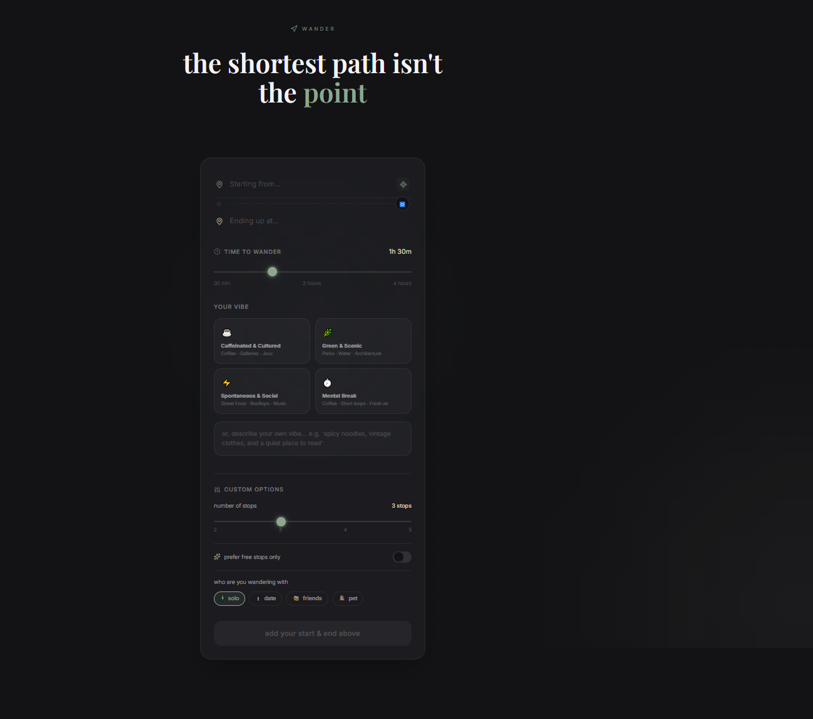
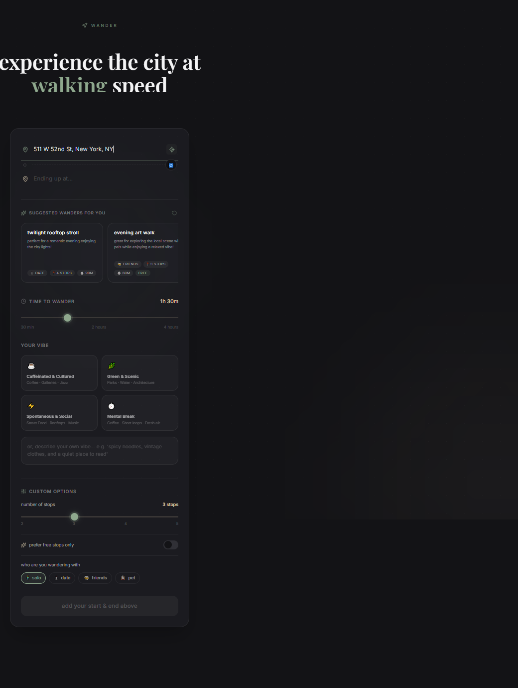
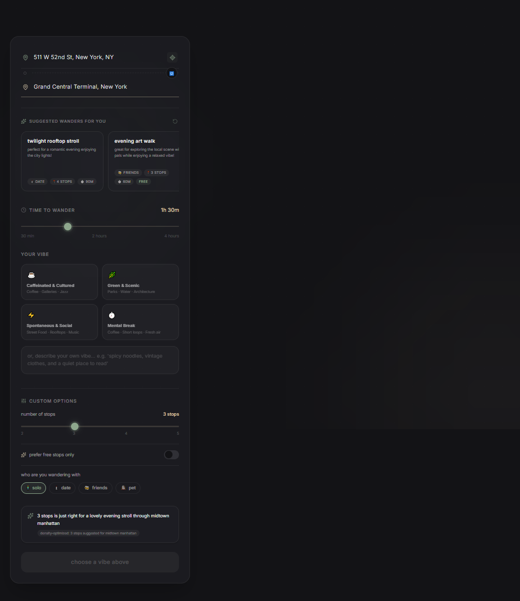
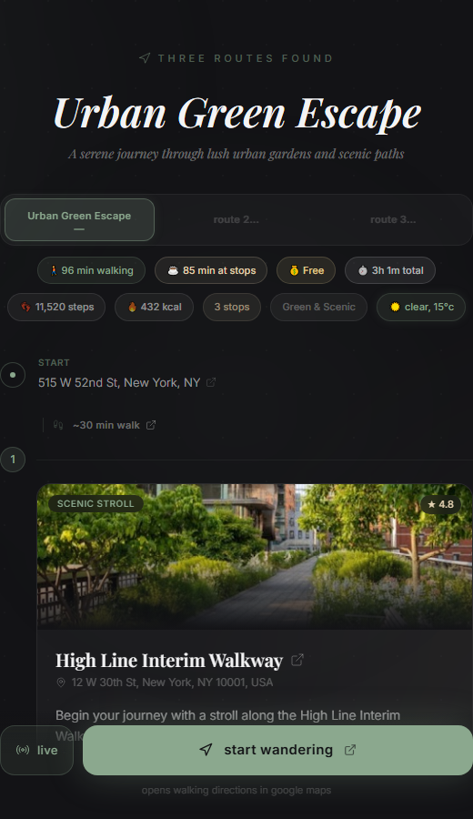
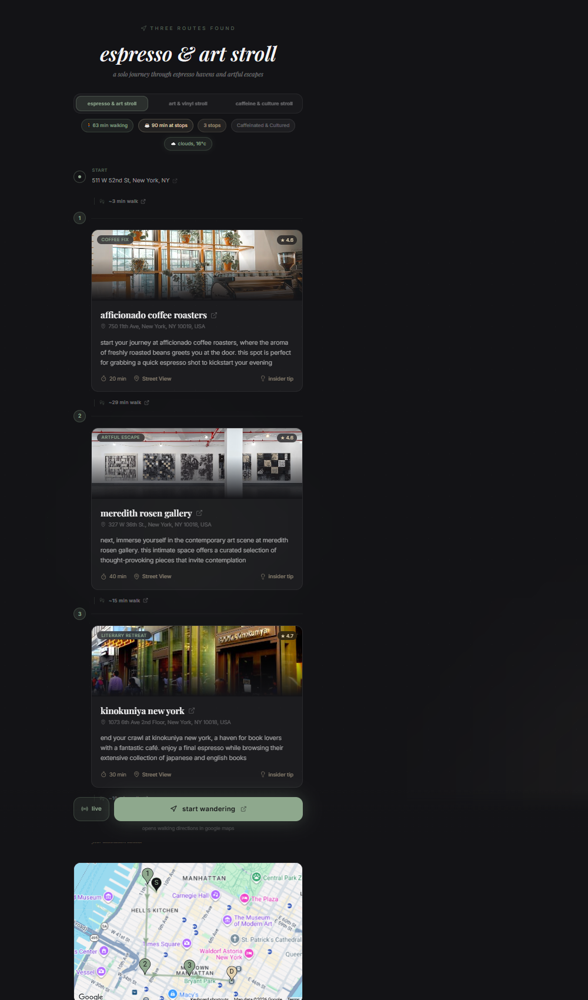

# wander

> *Stop commuting. Start wandering.*

A walking route planner that transforms standard A-to-B directions into three distinct, curated exploration paths. Built for both travelers arriving in a new city and locals looking to discover the hidden layers of their own streets, wander turns transit into exploration.

<div align="center">
  
</div>

---

## How It Works

wander accepts a starting location, an ending location, a time budget, and a desired vibe.

**1. Set your starting point**: Entering your starting location automatically generates 3 suggested wanders based on the neighborhood, weather, and time of day (such as morning coffee crawls vs. twilight bar hops). A single tap configures your entire walk parameters.

<div align="center">
  
</div>

<br/>

**2. Select a vibe and customize**: Set your destination, vibe, stops (2 to 5), and time budget. Choose from 6 curated vibe profiles, including **Feeling Lucky** (which grants the AI free rein to curate unusual routes with speakeasies, oddities museums, and architectural follies) or enter a custom description. A live pacing advisor validates if your constraints match real walking geometry.

<div align="center">
  
</div>

<br/>

**3. Stream and compare three routes**: The app sweeps the Google Places API along your walking corridor to source real venues and streams three themed walking routes:
* **Route 1 (Scenic and Relaxed)**: Prioritizes parks, waterfronts, and quiet streets.
* **Route 2 (Culturally Dense)**: Anchored by bookstores, galleries, and historic architecture.
* **Route 3 (Social and Lively)**: Focuses on cafes, food halls, local shops, and bars.

<div align="center">
  
</div>

<br/>

**4. Fine-tune your stops**: If a suggested stop does not fit your mood, tap **swap stop** on its card. You can request a "Surprise Me" quick-swap matching the active vibe, or type a custom adjustment (such as "bakery instead of coffee"). wander queries the Google Places API, calls GPT-4o to curate the replacement venue, and automatically updates the walking leg durations, map polyline, and Google Maps deep link.

<div align="center">
  
</div>

<br/>

**5. Start exploring**: Click **Start Wandering** to open the entire multi-stop itinerary pre-populated in Google Maps for turn-by-turn walking navigation. You can also download an .ics calendar invite with all stop details and maps links pre-loaded.

---

## Key Features

* **Suggested preset wanders**: Context-aware walking ideas generated from your starting point based on neighborhood, weather, and daypart.
* **Live Walk Mode**: Real-time GPS proximity tracking. Stops glow when you are within 150m. Dwells auto-advance progress and calculate remaining times.
* **Magic Wand Stop Swapping**: Click "swap stop" to replace any waypoint. Perform a quick surprise replacement matching your vibe or specify custom requirements (such as "bookstore instead of cafe").
* **Feeling Lucky Vibe**: A custom vibe profile giving the AI free rein to construct highly unique walks featuring hidden speakeasies, oddity museums, occult libraries, and architectural landmarks.
* **Neighborhood Passport**: Digital stamp book tracking every neighborhood, vibe, and stop you explore. Works even on shared route links.
* **Round-Trip Loops**: Locks starting point equal to destination for circular wanders starting and ending at your hotel or office.
* **Verified Google Places Data**: Every stop is sourced from the Google Places API, preventing location hallucination.
* **Weather-Aware Curation**: Rainy day? wander automatically pivots to indoor stops (museums, bookstores, covered markets).
* **Daypart Transitioning**: No coffee shops at 8 PM. Routes sequence logically across morning, afternoon, and evening.
* **Add to Calendar (ICS)**: Download calendar events preloaded with stop addresses, ratings, durations, and Google Maps deep links.
* **Shareable Routes**: Every route gets a permanent short link (/r/abc123). Recipients can check in to stops and earn passport stamps.
* **PWA Installable**: Install on iOS or Android directly from the browser for a full-screen native feel.

---

## Tech Stack

| Layer | Technology | Description |
|---|---|---|
| **Frontend** | Next.js 16 (App Router, TypeScript) | Obsidian black (#131316) and matcha green (#8BA88E) interface. |
| **Styling and Animations** | Tailwind CSS v4, Framer Motion v12 | Glassmorphism cards, fluid transitions, staggered timeline loading. |
| **Backend** | FastAPI (Python 3.13, Uvicorn) | High-performance Python backend serving SSE streams. |
| **Persistence** | SQLite3 | Shareable route links (/r/[id]). |
| **AI Processing** | OpenAI GPT-4o and GPT-4o-mini | Structured JSON outputs for route curation and keyword extraction. |
| **Geocoding** | Google Geocoding API | Converts natural language addresses to lat/lng coordinates. |
| **Venue Search** | Google Places API (New) | Parallel radar queries centered along the route corridor. |
| **Walking Feasibility** | Google Directions API | Real road-network walking durations between every stop. |
| **Weather** | OpenWeatherMap API | Live weather retrieval for weather-aware routing. |

---

## System Architecture

wander enforces a strict, multi-stage pipeline to generate walking tours:

```
User Request (start, end, time_budget, vibe, local_time)
    │
    ├─ 1. Geocode Start & End coordinates (Geocoding API)
    │
    ├─ 2. Fetch current weather conditions (OpenWeatherMap API)
    │
    ├─ 3. Keyword Extraction (GPT-4o-mini)
    │      Extracts Maps search queries from the user's custom vibe text.
    │
    ├─ 4. Corridor Radar Sweep (Places API New)
    │      5 parallel searches centered along the route path →
    │      15-20 verified venue candidates.
    │
    ├─ 5. Sequential Route Generation (GPT-4o)
    │      Streams 3 distinct themed routes via SSE.
    │      Venues used in Route 1 are excluded from Routes 2 & 3.
    │
    ├─ 6. Walking Validation (Directions API)
    │      Validates real road-network walking time between every stop.
    │
    ├─ 7. Persistence (SQLite3)
    │      Stores route data for permanent shareable links.
    │
    └─ Response streamed → Timeline, Ratings, Map Polyline, Deep Link, ICS
```

---

## AI and LLM Prompts

wander uses two specialized prompts in its backend pipeline:

### 1. Search Query Extractor (GPT-4o-mini)

Parses the user's natural language vibe into clean Google Places search queries.

```
You are an assistant that extracts specific Google Maps Places search terms from a descriptive vibe.
Extract 3 to 5 distinct, concrete search queries (e.g. 'bookstore', 'ramen', 'rooftop bar') matching the user's desires.
Return ONLY a JSON object: {'queries': ['query1', 'query2']}.
```

### 2. Route Generator (GPT-4o)

Fed a verified list of real Places results, weather context, daypart, and time budget. Forces geographically-sequenced selection of real venues only.

```
You are wander: an urban experience curator with encyclopedic local knowledge.
Your life isn't a chore; wander. Help the user feel that.

VERIFIED VENUES (sourced from Google Places, sorted Start → End):
{venues_context}

MISSION: Build ONE walking route from {start_location} to {end_location} matching: {route_type_desc}.
Use 3–4 stops ONLY from the numbered list above.

TIME BUDGET: {time_budget_minutes} minutes TOTAL.
→ Each stop: ~{per_stop_mins} min dwell.

STRICT RULES:
1. Use ONLY listed venues: no invented stops.
2. Stops must progress in strictly increasing index order (no backtracking).
3. Hard cap: Σ(duration_mins + walk_to_next_mins) ≤ {time_budget_minutes}.
4. Write like a local who's lived here 10 years. Never say "charming" or "vibrant."
5. Insider tips must be specific to this exact venue.
```

Dynamic chunks are automatically appended: Weather (indoor pivot on rain/snow), Daypart (no coffee at 8 PM), Exclusion (deduplicates across the 3 routes).

---

## Running Locally

### Step 0: Environment Configuration

Before running any installation or execution commands, duplicate the environment configuration template file `wander-api/.env.example` into a local `wander-api/.env` file and populate all variables with your active API keys:

```bash
cp wander-api/.env.example wander-api/.env
```

Ensure that all required variables (`OPENAI_API_KEY`, `GOOGLE_MAPS_API_KEY`, and `OPENWEATHER_API_KEY`) are populated prior to startup.

### Prerequisites
* Node.js 18+ & npm
* Python 3.13+

### Backend
```bash
cd wander-api
python -m venv venv
venv\Scripts\activate          # Windows
source venv/bin/activate       # macOS/Linux
pip install -r requirements.txt
uvicorn main:app --reload --port 8000
```

### Frontend
```bash
cd wander-ui
npm install
npm run dev
```

Visit **http://localhost:3000**. The Next.js dev server proxies `/api/*` to FastAPI at `localhost:8000`.

---

## Verification and Testing

```bash
# Verify integrity of Google API credentials
wander-api\venv\Scripts\python test_google_apis.py

# Full backend integration and retrieval-augmented generation test suite
wander-api\venv\Scripts\python test_v3.py
```

Asserts:
* Exactly 3 distinct routes generated.
* Every route has a valid Google Maps walking deep link.
* `google_rating` present on all RAG-sourced stops.
* Real `walk_to_next_mins` from Directions API between every stop.
* Time budgets respect walking and dwell constraints.

---

## Project Layout

```
wander/
230: ├── wander-api/
231: │   ├── main.py               # Route generation pipeline, constraints, SSE streaming
232: │   ├── database.py           # SQLite persistence for shared routes
233: │   ├── requirements.txt
234: │   └── .env                  # API keys (never committed)
235: │
236: ├── wander-ui/
237: │   ├── app/
238: │   │   ├── components/
239: │   │   │   └── MapPreview.tsx      # Google Maps embed with route polyline
240: │   │   ├── hooks/
241: │   │   │   ├── useWalkMode.ts      # Live GPS walk mode, proximity detection
242: │   │   │   └── usePassport.ts      # Neighborhood passport (localStorage)
243: │   │   ├── r/[id]/page.tsx         # Shareable route renderer
244: │   │   ├── globals.css             # Design tokens, animation utilities
245: │   │   ├── layout.tsx              # Inter + Playfair Display fonts
246: │   │   └── page.tsx                # Main app: inputs, routes, timeline, calendar
247: │   ├── public/
248: │   │   ├── manifest.json           # PWA manifest
249: │   │   └── sw.js                   # Service worker cache
250: │   └── next.config.ts              # /api/* proxy → localhost:8000
251: │
252: ├── assets/                         # App screenshots
253: └── README.md
```

---

## License

MIT
