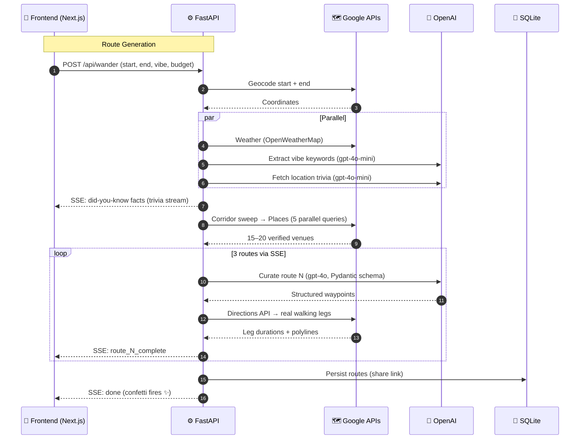

# wander 🗺️

> *Your life isn't a chore; wander.*

An AI-powered urban itinerary generator that **streams three distinct walking routes in real time**. Enter a starting point, destination, vibe, and time budget — wander does the rest.

Built on a RAG pipeline anchored by verified Google Places data, GPT-4o route curation, Server-Sent Events streaming, and a dark glassmorphism UI.

---

## How It Works

```
You → [Start, End, Vibe, Time Budget]
         │
         ├─ 1. Geocode coordinates (Google Geocoding API)
         ├─ 2. Fetch weather context (OpenWeatherMap)
         ├─ 3. Extract vibe keywords (GPT-4o-mini)
         ├─ 4. Corridor radar sweep → 15–20 verified venues (Google Places API New)
         ├─ 5. Stream 3 themed routes via SSE (GPT-4o RAG)  ← confetti fires here ✨
         ├─ 6. Validate real walking legs (Google Directions API)
         └─ 7. Persist for shareable link (SQLite)
```

During loading, **location-aware trivia facts** stream as `did-you-know` SSE events — no generic spinner. The frontend replaces its message text on every trivia fact received.

When all three routes finish streaming, **confetti fires** from both sides of the screen.

---

## Features

### 🧭 Route Generation
| Feature | Description |
|---|---|
| **7 Vibe Presets** | Caffeinated & Cultured · Green & Scenic · Spontaneous & Social · Mental Break · Off the Grid · Conference Break · Feeling Lucky |
| **Vibe-Specific Archetypes** | Each vibe generates 3 named sub-themes (e.g. "Golden Hour" → *the rooftop circuit / the golden park loop / the dusk market stroll*) |
| **Custom Vibe Text** | Describe your own vibe ("spicy noodles, vintage clothes, and a quiet place to read") — GPT-4o-mini extracts Places queries |
| **Feeling Lucky** | AI generates a surprise theme (speakeasies, vinyl records, architectural follies) — different every time |
| **Round-Trip Mode** | Lock start = end for circular walking loops |
| **Step Goal Mode** | Alternative to time budget — enter target step count |
| **RAG, Zero Hallucination** | GPT-4o selects only from verified venue candidates, never invents stops |
| **Weather-Aware Routing** | Pivots to indoor spaces (museums, covered markets) when rain/snow detected |
| **Daypart Transitions** | Coffee-first in the morning, bars and jazz clubs in the evening |

### 🎛️ Advanced Filters Accordion
Hidden by default, revealed by clicking **advanced filters**:
| Filter | Range |
|---|---|
| **Number of Stops** | 2–5 stops per route |
| **Max Budget Per Person** | $10–$150 (or "unlimited") |
| **Free Stops Only** | Toggle — prefer parks, landmarks, free cultural stops |

### 🚶 Walk Mode
Live GPS navigation with:
- **Proximity Glow** — route card pulses green within 150m
- **Dwell Timer Auto Check-In** — 5 min at a stop auto-marks it visited
- **Manual Check-In** button ("i'm here")
- **Vibe Detour** button — pivot mid-walk to a nearby surprise stop (Foursquare + OpenTripMap candidates)

### ↔️ Swap Stop
Replace any waypoint:
- **"Surprise Me"** — AI picks a new stop matching the vibe
- **Custom Refinement** — type "bakery instead of coffee" or similar text
- Loading overlay shows *"Finding a new stop along your path..."*

### 💡 Insider Tips
Every waypoint card shows a concierge-style local secret — always visible, no toggle required. Examples: best seat in the house, off-menu item, ideal time of day.

### 🌀 Dynamic Trivia Loading
During generation, the loading screen shows location-aware trivia facts streamed via SSE (`did-you-know` events). Three obscure facts about your starting city replace the message text in sequence — no more static spinner messages.

### 📍 Pacing Advisor
Before generating, a background call to `/api/advisor` checks:
- Neighborhood density rating
- Recommended stop count for the corridor
- Feasibility status (`optimal` / `tight` / `impossible`)
- Weather advisory
Client-side also validates: if time budget < 2× (stops × 5-min walk), flags impossible immediately.

### 🔗 Route Sharing
Every generated route persists to SQLite and returns a short ID. Share `/r/[id]` — includes full-resolution OG image card (Next.js Edge API route, 1200×630).

### 🗺️ Leaflet Map
Live map below the route tabs shows:
- Start/end markers
- Walking polyline between stops
- Waypoint pins with vibe-colored popups

### ♿ Comfort Mode
Toggle `Aa` in the header — scales all text, icons, and padding up for accessibility.

### 📅 Add to Calendar
Download any route as `.ics` calendar events with coordinates, ratings, and durations pre-loaded.

### 🏆 Neighborhood Passport
Gamified tracking across sessions: visited neighborhoods unlock passport stamps and update streak + level badge.

---

## Architecture



### Tech Stack

| Layer | Technology |
|---|---|
| **Frontend** | Next.js 16 (App Router, TypeScript, Turbopack) |
| **Styling** | Tailwind CSS v4, Framer Motion v12 |
| **UI Theme** | Obsidian black `#131316` · Matcha green `#8ba88e` · Sand `#e5d3b3` |
| **Backend** | FastAPI (Python 3.13, Uvicorn) |
| **Streaming** | Server-Sent Events (SSE) with `asyncio` generators |
| **AI** | OpenAI GPT-4o (route curation) + GPT-4o-mini (keywords, trivia) |
| **Geocoding** | Google Geocoding API |
| **Venues** | Google Places API (New) — primary · Foursquare Places — detours · OpenTripMap — cultural sites |
| **Navigation** | Google Directions API (real walking times + polylines) |
| **Elevation** | Google Elevation API (slope/incline validation) |
| **Weather** | OpenWeatherMap API |
| **Maps (UI)** | Leaflet.js |
| **Persistence** | SQLite3 (`database.py`) |
| **OG Images** | Next.js Edge API (`@vercel/og`, 1200×630) |
| **PWA** | `manifest.json` + `sw.js` service worker |

### Vibe → Route Archetypes

Each vibe preset generates 3 specifically named sub-themes:

| Vibe | Route 1 | Route 2 | Route 3 |
|---|---|---|---|
| ☕ Caffeinated & Cultured | the morning ritual | the gallery drift | the literary afternoon |
| 🌿 Green & Scenic | the park connector | the scenic overlook loop | the botanist's wander |
| ⚡ Spontaneous & Social | the rooftop circuit | the local's night out | the market crawl |
| ⏱️ Mental Break | the decompression loop | the mindful stroll | the reset walk |
| 🗺️ Off the Grid | the secret city | the quiet corner | the vintage crawl |
| 💼 Conference Break | the power hour | the delegate's drift | the layover loop |
| 🎲 Feeling Lucky | serendipity drift | avant-garde stroll | curiosity loop |

For custom vibes, fallback archetypes: *the discovery route* / *the local's pick* / *the mood route*.

---

## Market Context

**Business Traveler TAM**: 500M+ annual business trips. Conference-goers spend 3–5 days in unfamiliar cities, are highly time-constrained (60–90 minute break windows), and consistently over-index on premium local experiences. wander's **Conference Break** vibe + **business trip** companion generates tight itineraries formatted like concierge recommendations — espresso with WiFi, iconic photo landmark, quick-service lunch — all back by 2pm.

### Unit Economics

| Cost Item | Per 100 Runs |
|---|---|
| Google Places (5 queries/run) | $12.80 |
| GPT-4o route curation (3 routes) | $4.50 |
| Google Directions + Geocoding | $3.25 |
| GPT-4o-mini (keywords + trivia) | $0.02 |
| **Total raw variable cost** | **~$0.23/run** |

With 10% Premium subscribers at $4.99/mo + promoted waypoints + affiliate commissions: **~53% gross margin** at scale.

---

## Getting Started

### Prerequisites
- Node.js 18+, npm
- Python 3.13+
- API keys: `OPENAI_API_KEY`, `GOOGLE_MAPS_API_KEY` (required) + `OPENWEATHER_API_KEY`, `FOURSQUARE_API_KEY`, `OPENTRIPMAP_API_KEY` (optional but unlock full features)

### Step 1: Environment

```bash
cp wander-api/.env.example wander-api/.env
# Fill in your API keys
```

### Step 2: Backend

```bash
cd wander-api
python -m venv venv
source venv/bin/activate        # macOS/Linux
# venv\Scripts\activate         # Windows
pip install -r requirements.txt
uvicorn main:app --reload --port 8000
```

### Step 3: Frontend

```bash
cd wander-ui
npm install
npm run dev
```

Open **http://localhost:3000**. The Next.js dev server proxies `/api/*` requests to `localhost:8000`.

---

## Project Layout

```
wander/
├── wander-api/
│   ├── main.py               # Route pipeline, SSE streaming, trivia, swap, detour
│   ├── database.py           # SQLite persistence for /r/[id] share links
│   ├── requirements.txt
│   └── .env                  # API keys (never committed)
│
├── wander-ui/
│   ├── app/
│   │   ├── api/og/           # Edge OG image generator (1200×630, @vercel/og)
│   │   ├── components/
│   │   │   ├── WanderMap.tsx             # Leaflet map with route polyline
│   │   │   ├── RotatingTagline.tsx       # Hero tagline rotator
│   │   │   └── WanderCompleteOverlay.tsx # Completion modal (streaks, level badge)
│   │   ├── hooks/
│   │   │   ├── useWalkMode.ts      # Live GPS, proximity detection, dwell timer
│   │   │   ├── usePassport.ts      # Neighborhood passport (localStorage, streaks)
│   │   │   └── usePreferences.ts   # Preference memory (vibe history, form pre-fill)
│   │   ├── r/[id]/           # Shareable route renderer + "steal this wander" CTA
│   │   ├── globals.css       # Design tokens, glassmorphism, animate-shimmer
│   │   ├── layout.tsx        # Inter + Playfair Display fonts
│   │   └── page.tsx          # Main app (3154 lines): inputs, routes, timeline, map
│   └── public/
│       ├── manifest.json     # PWA manifest
│       └── sw.js             # Service worker cache
│
├── docs/
│   ├── business_plan.md      # Unit economics & revenue model
│   ├── market_size_presentation.md
│   └── vc_one_pager.md
│
└── tests/
    ├── test_ghost_fixes.py         # No print() calls, CORS, OTM scope, parallel queue
    ├── test_parallel_generation.py # asyncio.gather, SSE format, queue ordering
    ├── test_google_apis.py
    └── test_v3.py
```

---

## Testing

```bash
# Run full test suite
cd wander
python -m pytest tests/ -v

# Verify backend compiles
cd wander-api && python -m py_compile main.py

# Verify frontend builds
cd wander-ui && npm run build
```

---

## License

MIT
