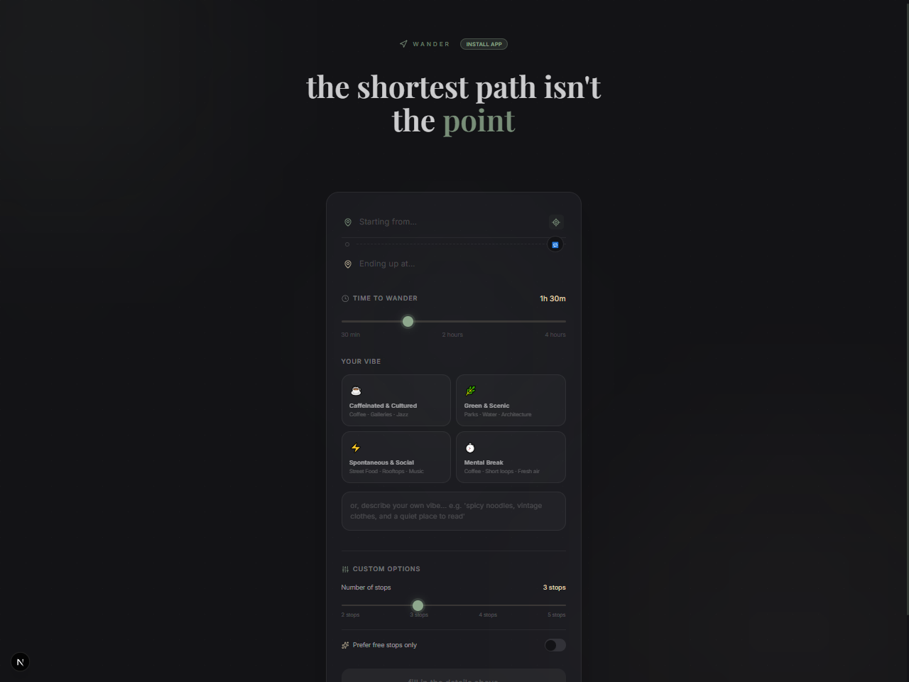
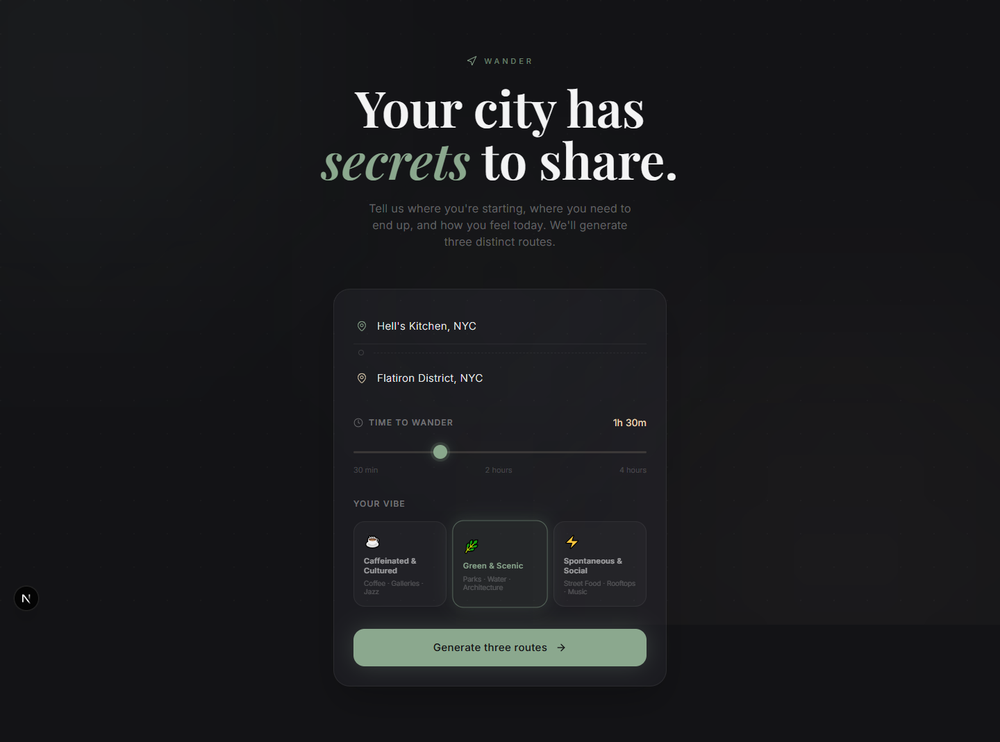
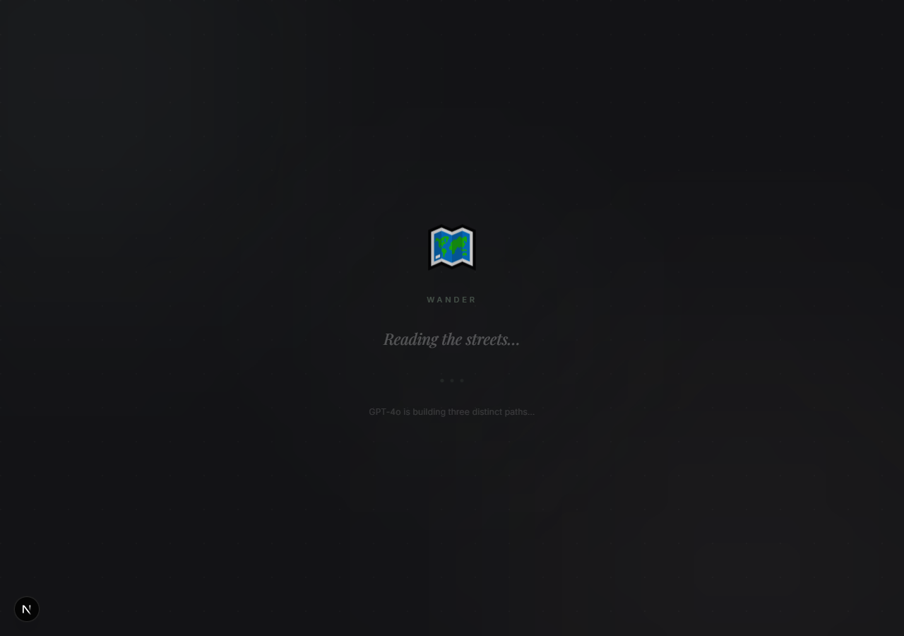
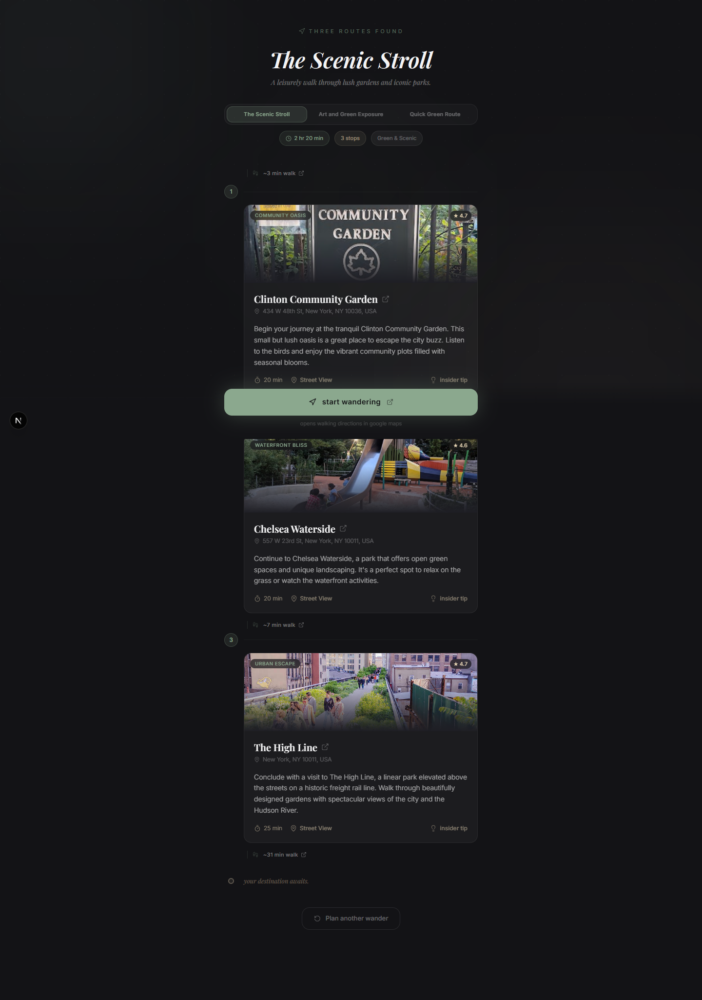
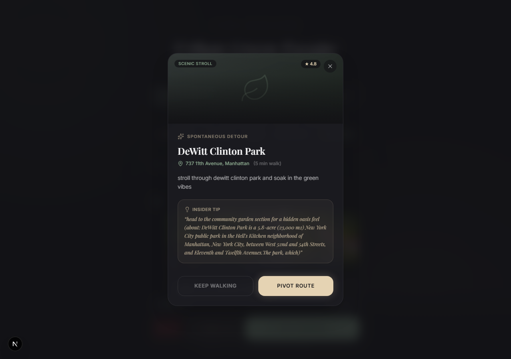
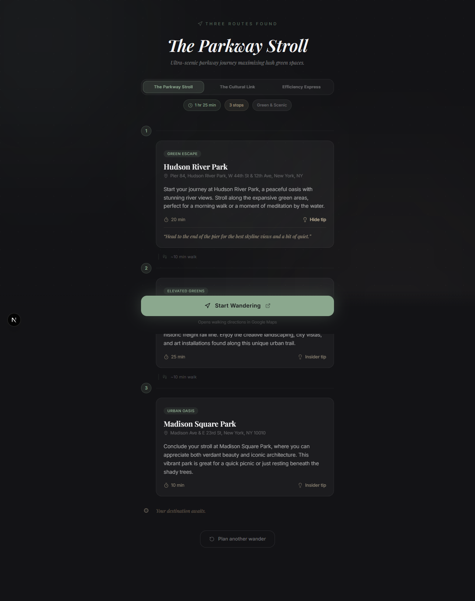
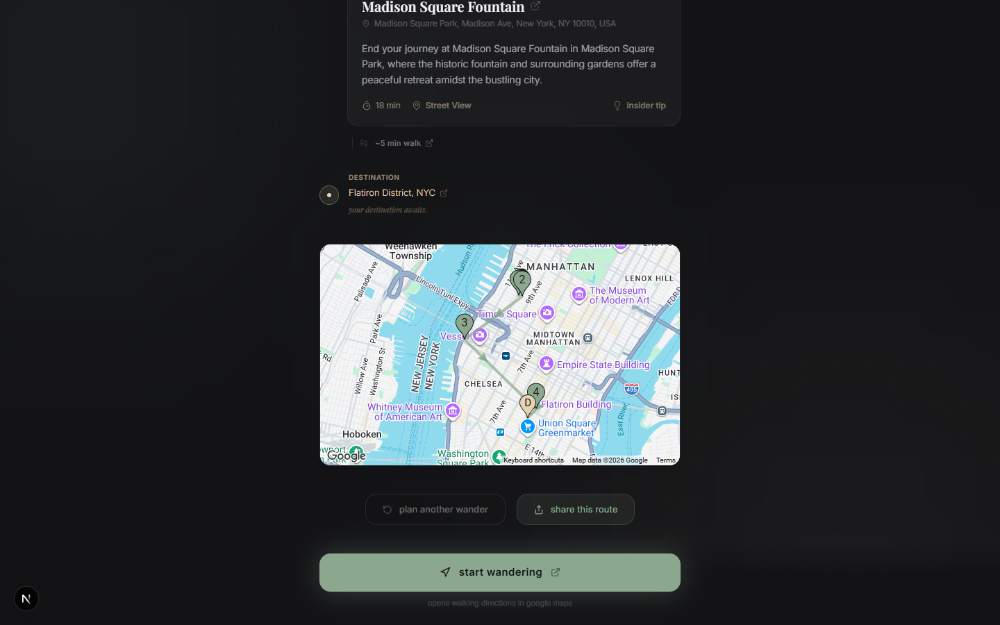
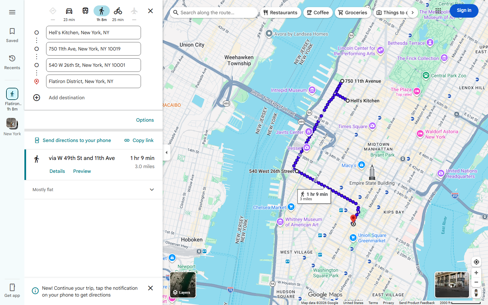

# Wander UI

> *Your life isn't a chore; wander.*

The Next.js 16 frontend for **Wander** — generates three distinct, Google-verified walking routes per request, each one tap away from live GPS navigation in Google Maps.

---

## Stack

| Layer | Technology |
|---|---|
| Framework | Next.js 16.2 (App Router, TypeScript) |
| Styling | Tailwind CSS v4 |
| Animations | Framer Motion v12 |
| Fonts | Playfair Display (headings) + Inter (body) |
| API | FastAPI backend via `/api/*` proxy rewrite |

---

## Design System — *Quiet Luxury / Digital Oasis*

| Token | Value | Use |
|---|---|---|
| Obsidian | `#131316` | Page background |
| Surface | `#1E1E24` | Glassmorphism cards |
| Matcha | `#8BA88E` | Accent, CTAs, active states |
| Sand | `#E5D3B3` | Ratings, timers, insider tips |
| Cream | `#F4F4F5` | Body text |

---

## Running Locally

Requires the FastAPI backend running on `localhost:8000`.

```bash
npm install
npm run dev
# → http://localhost:3000
```

All `/api/*` requests are proxied to `http://localhost:8000/api/*` via `next.config.ts`.

---

## End-to-End Walkthrough

A real session captured: *Hell's Kitchen → Flatiron District, 90 min, Green & Scenic.*

---

### Screen 1 — Landing

Open [http://localhost:3000](http://localhost:3000). The input form appears over a dark obsidian background with ambient gradient orbs and a subtle dot-grid texture.



**Design visible:**
- Serif headline: *"Your city has **secrets** to share."* — Playfair Display
- Glassmorphism card with `backdrop-blur` + `border-white/7`
- Navigation icon + `WANDER` wordmark in Matcha at 70% opacity
- Three vibe selector cards (Caffeinated & Cultured / Green & Scenic / Spontaneous & Social)
- Disabled CTA button until all fields are filled

---

### Screen 2 — Form Filled

Enter your start and end points. Click a vibe. The button activates.



**Interaction details:**
- `Starting from…` / `Ending up at…` — transparent text inputs, no border clutter
- Time slider: 30 min → 4 hours in 15-minute steps, Sand-colored current value display
- Vibe card spring-scales on select, glows with vibe-matched color
- `Generate three routes →` button activates in Soft Matcha green

---

### Screen 3 — Loading

Click **Generate three routes**. The app crossfades to the loading state while the V3 RAG pipeline runs (geocode → Places radar → GPT-4o → Directions API).



**What's happening:**
- 🗺️ emoji drifts on a slow `translateY` loop
- Italic Playfair Display text cycles every 2 seconds:
  *Reading the streets… → Curating three paths… → Consulting the locals…*
- Three pulsing dots with staggered opacity + scale animation
- Typical response time: 15–25 seconds (Places sweep + GPT-4o + 6 Directions calls)

---

### Screen 4 — Three Routes

Routes arrive. The page crossfades to the itinerary view with a staggered card animation.



**V3 features visible:**
- **Route carousel** at the top — Framer Motion `layoutId` pill slides between Route 1 / 2 / 3
- Each tab shows the route name; active tab highlighted in Matcha
- **Numbered stop cards** — vibe tag pill, location name, `★ 4.6` Google rating badge, address, description, duration
- **Walk labels** between stops: *🚶 ~12 min walk* (real Google Directions times)
- **Sticky "Start Wandering"** button pinned to the bottom with frosted gradient

**Routes generated (Green & Scenic vibe):**

| # | Route | First Stop |
|---|---|---|
| 1 | **The Parkway Stroll** | Hudson River Park |
| 2 | **The Cultural Link** | Intrepid Sea, Air & Space Museum |
| 3 | **Efficiency Express** | Times Square |

---

### Screen 5 — Carousel Switch

Click Route 2. The Matcha pill slides over, the old timeline fades out, and Route 2's stops stagger in fresh.



**Animation:** `AnimatePresence mode="wait"` with `key={selectedIndex}` — full stagger re-runs on every tab change. No flash. No layout shift.

---

### Screen 6 — Insider Tip

Each stop card has a hidden **Insider tip**. Click to expand.



Example reveal for Hudson River Park:
> *"Grab a seat at the end of the pier for the best sunset views over the Hudson."*

The tip panel expands with an `AnimatePresence` height animation, separated by a Sand-tinted divider.

---

### Screen 7 — Start Wandering

Tap **Start Wandering**. A new tab opens directly in Google Maps with your multi-stop walking tour pre-loaded.



The deep link format:
```
https://www.google.com/maps/dir/?api=1
  &origin=Hell%27s+Kitchen%2C+NYC
  &destination=Flatiron+District%2C+NYC
  &waypoints=750+11th+Ave...%7C540+W+26th+St...
  &travelmode=walking
```

### Screen 8 — Google Maps Navigation

Google Maps opens with the full walking route rendered — blue dotted line, all stops pinned, total time and distance calculated.



**What you see:**
- Blue dotted walking route tracing from Hell's Kitchen → Flatiron
- All waypoints pinned on the map (750 11th Ave, 540 W 26th St)
- **Route summary:** *via W 49th St and 11th Ave — 1 hr 9 min / 3.0 miles*
- Walking mode icon selected in the transport bar
- Tap the blue **Start** button for turn-by-turn GPS navigation

All addresses are URL-encoded server-side in `build_maps_deep_link()`. The native Google Maps app opens on mobile.

---

## V3 API Response Shape

```json
{
  "routes": [
    {
      "route_name": "The Parkway Stroll",
      "theme_summary": "Ultra-scenic waterfront arc with maximum green space.",
      "total_walking_time_mins": 112,
      "navigation_deep_link": "https://www.google.com/maps/dir/?api=1&...",
      "waypoints": [
        {
          "order": 1,
          "location_name": "Hudson River Park",
          "address_hint": "Pier 84, W 44th St & 12th Ave, New York, NY",
          "google_rating": 4.6,
          "action_description": "Start your journey at the edge of Manhattan...",
          "duration_mins": 20,
          "walk_to_next_mins": 12,
          "vibe_tag": "Waterfront Walk",
          "insider_tip": "Grab a seat at the end of the pier..."
        }
      ]
    }
  ]
}
```

`google_rating` is sourced directly from Google Places — not generated by the AI.  
`walk_to_next_mins` is computed by Google Directions API — not estimated by the AI.

---

## File Structure

```
wander-ui/
├── app/
│   ├── globals.css        # Tailwind v4 @theme tokens, custom animations
│   ├── layout.tsx         # Google Fonts: Playfair Display + Inter
│   └── page.tsx           # Full 3-screen app (Input → Loading → Route)
├── public/
├── next.config.ts         # /api/* → localhost:8000 rewrite proxy
└── package.json
```

---

## Screen Reference

| File | Screen | Key V3 Feature |
|---|---|---|
| `assets/01-landing.png` | Input form | Glassmorphism card, ambient orbs |
| `assets/02-form-filled.png` | Form filled | Vibe selection spring animation |
| `assets/03-loading.png` | Loading state | Cycling serif text, breathing dots |
| `assets/04-route.png` | Route result | 3-tab carousel, ★ rating badges, walk labels |
| `assets/05-carousel.png` | Tab switched | Framer Motion `layoutId` pill slide |
| `assets/06-insider-tip.png` | Tip expanded | AnimatePresence height animation |
| `assets/07-sticky-button.png` | Start Wandering | Frosted gradient, deep link handoff |
| `assets/08-google-maps.png` | Google Maps open | Blue walking route, all stops pinned, 1hr 9min / 3mi |
