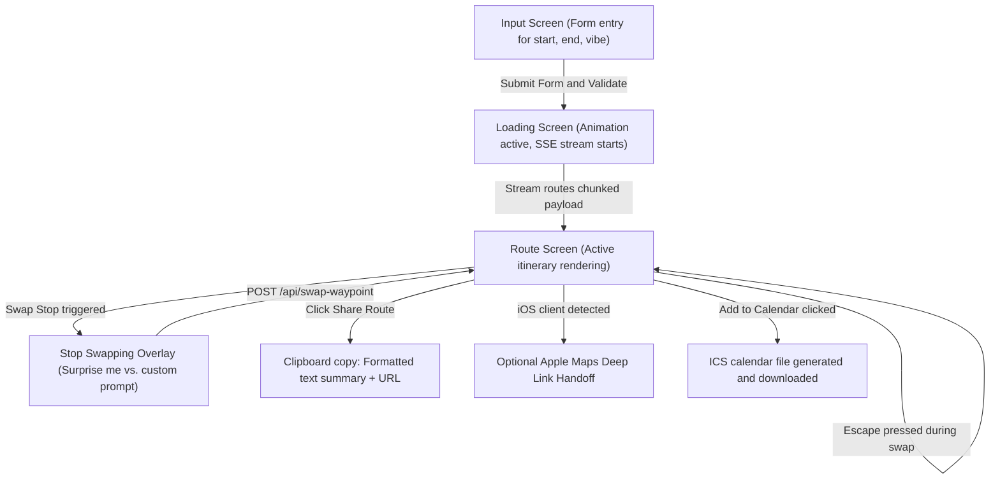

# Wander UI

The Next.js 16 frontend interface for the wander walking route planner. This client application displays generated routes, manages active tracking state, and handles coordinate exports for navigation.

---

## Technical Stack

* **Framework**: Next.js 16.2 (App Router, TypeScript)
* **Styling**: Tailwind CSS v4
* **Animations**: Framer Motion v12
* **Fonts**: Playfair Display (headings) and Inter (body)
* **Routing and Proxying**: API requests mapped via Next.js rewrites in `next.config.ts`

---

## Design System

The visual design uses a dark, minimal palette:

* **Obsidian (`#131316`)**: Primary page background
* **Surface (`#1E1E24`)**: Frosted glass container background
* **Matcha (`#8BA88E`)**: Accent colors, primary actions, and active states
* **Sand (`#E5D3B3`)**: Ratings, durations, and expanded details
* **Cream (`#F4F4F5`)**: Standard text copy

---

## Client Application Flow

The following state machine details how the Next.js client transitions between screens and handles data operations:



---

## Core Interactive Features

### 1. Dual-Input Mode (Time vs. Steps)
* **Time Budget**: Configures trip duration from 30 minutes to 4 hours in 15-minute steps.
* **Step Goal**: Sets target steps from 3,000 to 15,000 in increments of 1,000. Steps are converted client-side to walking minutes (using 120 steps per minute) and added to estimated stop dwell times.

### 2. Address Quick-Copy
* Stop addresses are rendered as copy buttons. Clicking an address writes it to the clipboard and triggers a temporary confirmation badge.

### 3. Formatted Itinerary Share Summary
* Sharing a route writes a structured plain-text summary containing the route name, sequential stop list, and shared URL directly to the user's clipboard.

### 4. Calorie and Step Expenditure Badges
* Displays estimated steps and calories burned (using 4.5 kcal per walking minute) in the route metadata header.

### 5. Weather-Aware Placeholders
* Analyzes geolocated weather forecast advice to update custom vibe text placeholders dynamically (e.g. suggesting cozy indoor markets during precipitation, and park strolls during clear skies).

### 6. Interactive Dwell Duration Progress Meter
* During GPS Walk Mode, waypoints render a horizontal progress bar tracking elapsed time against that stop's target duration.

### 7. Keyboard Navigation Shortcuts
* Keys `1`, `2`, and `3` switch route tabs. Pressing `Escape` closes active stop-swapping overlay inputs.

### 8. Custom iOS Native Navigation Selector
* Renders a secondary "apple maps" button alongside the default Google Maps button on iOS devices, routing walking directions from start to end locations.

### 9. Confetti Particle Canvas
* Shoots canvas particle bursts from the bottom corners when route generation completes.

### 10. Dynamic Server-Side Share Layout
* Configures layout metadata in `app/r/[id]/layout.tsx` to query shared route records from the SQLite database server-side, returning Open Graph tags for rich previews.

---

## Running Locally

Ensure the FastAPI API backend is running on `localhost:8000`.

```bash
npm install
npm run dev
```

The Next.js development server runs on **http://localhost:3000** and proxies `/api/*` queries to the backend.

---

## File Directory Structure

```
wander-ui/
├── app/
│   ├── components/
│   │   ├── MapPreview.tsx     # Google Maps view utilizing leaflet or vis.gl
│   │   └── RotatingTagline.tsx# Inputs screen header text transitions
│   ├── hooks/
│   │   ├── useWalkMode.ts     # Live GPS tracking and proximity checks
│   │   └── usePassport.ts     # Neighborhood passport local storage logs
│   ├── r/[id]/
│   │   ├── layout.tsx         # Server-side Open Graph metadata generator
│   │   └── page.tsx           # Shared route viewer client page
│   ├── globals.css            # Gradients and custom animations
│   ├── layout.tsx             # Playfair Display and Inter configurations
│   └── page.tsx               # Main application inputs, logic, and timeline view
├── public/
│   ├── manifest.json          # PWA configuration
│   └── sw.js                  # PWA caching service worker
├── next.config.ts             # API rewrite configurations
└── package.json
```
