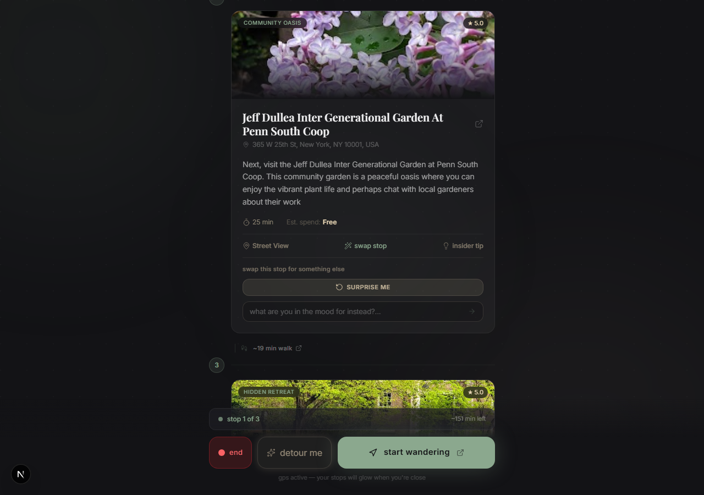

# Wander UI

> *Stop planning. Start wandering.*

The Next.js 16 frontend for **Wander** — an AI-powered urban itinerary generator that produces three distinct walking routes per request, each one click away from live GPS navigation.

---

## Stack

| Layer | Technology |
|---|---|
| Framework | Next.js 16.2 (App Router, TypeScript) |
| Styling | Tailwind CSS v4 |
| Animations | Framer Motion v12 |
| Fonts | Playfair Display (serif headings) + Inter (sans body) |
| API | FastAPI backend via `/api/*` proxy rewrite |

---

## Design System

**"Quiet Luxury / Digital Oasis"** — the exact opposite of Google Maps.

| Token | Value | Use |
|---|---|---|
| Obsidian | `#131316` | Page background |
| Surface | `#1E1E24` | Glassmorphism cards |
| Matcha | `#8BA88E` | Primary accent, CTA, route line |
| Sand | `#E5D3B3` | Icons, time labels, insider tips |
| Cream | `#F4F4F5` | Body text |

---

## Running Locally

**Prerequisites:** The FastAPI backend must be running on `localhost:8000`.

```bash
# From wander-ui/
npm install
npm run dev
```

App available at **http://localhost:3000**

The `next.config.ts` proxies all `/api/*` requests to `http://localhost:8000/api/*` — no hardcoded backend URLs in client code.

---

## End-to-End Example

This walkthrough shows a real session: *Hell's Kitchen → Flatiron District, 120 min, Green & Scenic vibe.*

---

### Step 1 — The Landing Screen

Open [http://localhost:3000](http://localhost:3000). You are greeted by the input form: two borderless location fields, a matcha-green slider for time budget, and three vibe selector cards.


**Design details visible:**
- Serif headline: *"Your city has **secrets** to share."* in Playfair Display
- Glassmorphism card with `backdrop-blur` + `border-white/7`
- Dot-grid background texture at 2.5% opacity
- Ambient matcha + sand gradient orbs in the background

---

### Step 2 — Filling the Form

- **Starting from:** `Hell's Kitchen, NYC`
- **Ending up at:** `Flatiron District, NYC`
- **Time:** 90 min (slider)
- **Vibe:** 🌿 Green & Scenic *(click to select — the card scales up with spring physics)*


Once all three fields are filled, the CTA changes from the disabled state to the active **"Generate three routes →"** button in Soft Matcha green.

---

### Step 3 — The Loading Screen

Click **Generate three routes**. The app transitions with a crossfade and enters the loading state.


**What you see:**
- 🗺️ map emoji gently drifting (`translateY` loop animation)
- Italic Playfair Display text cycling every 2 seconds through human-sounding messages:
  - *Reading the streets…*
  - *Curating three paths…*
  - *Consulting the locals…*
  - *Perfecting the timing…*
  - *Uncovering hidden gems…*
  - *Almost ready to wander…*
- Three pulsing dots with staggered timing
- GPT-4o typically responds in 10–20 seconds

---

### Step 4 — The Three-Route Result

When the routes arrive, the screen cross-fades into the itinerary view. GPT-4o generated three completely distinct routes:

| # | Route Name | Character | Stops |
|---|---|---|---|
| 1 | **Riverside Reverie** | Ultra-scenic, max green space | Hudson River Park → High Line → Madison Square Park |
| 2 | **Art & Arbors** | Culturally immersive, local art | Clinton Garden → Gagosian Gallery → Gramercy Park |
| 3 | **Direct to Delight** | Efficient, iconic anchors | Bryant Park → Union Square Park |


**Key UI elements:**
- **Route carousel** at the top — click any tab and the matcha pill slides over via Framer Motion `layoutId`. The full timeline re-animates with a stagger.
- **Stop cards** with vibe tag pill, serif location name, address, description, duration badge
- **Walk labels** between stops: *🚶 ~10 min walk*
- **Sticky "Start Wandering" button** pinned to the bottom, frosted gradient footer

---

### Step 5 — Insider Tips

Each stop has a hidden **Insider tip** button. Click it to expand a local secret:



Example tip revealed for Hudson River Park – Pier 84:
> *"Grab a seat at the end of the pier for the best sunset views over the Hudson."*

---

### Step 6 — Start Wandering (Google Maps Handoff)

Click the **Start Wandering** button. A new tab opens directly in Google Maps with your full multi-stop walking tour pre-loaded and ready for GPS navigation.

The deep link format used:
```
https://www.google.com/maps/dir/?api=1
  &origin=Hell%27s+Kitchen%2C+NYC
  &destination=Flatiron+District%2C+NYC
  &waypoints=Hudson+River+Park%2C+W+44th+St...%7CThe+High+Line...%7CMadison+Square+Park...
  &travelmode=walking
```

All waypoint addresses are URL-encoded server-side in `build_maps_deep_link()` before being returned in the JSON payload.

---

## API Response Shape (V2)

```json
{
  "routes": [
    {
      "route_name": "Riverside Reverie",
      "theme_summary": "Ultra-scenic route with maximum green space and river views.",
      "total_walking_time_mins": 115,
      "navigation_deep_link": "https://www.google.com/maps/dir/?api=1&origin=...",
      "waypoints": [
        {
          "order": 1,
          "location_name": "Hudson River Park",
          "address_hint": "Pier 84, W 44th St & 12th Ave, Hell's Kitchen, New York, NY",
          "action_description": "Start your journey along the Hudson...",
          "duration_mins": 20,
          "walk_to_next_mins": 10,
          "vibe_tag": "Waterfront Walk",
          "insider_tip": "Grab a seat at the end of the pier for the best sunset views."
        }
      ]
    },
    { "route_name": "Art & Arbors", "...": "..." },
    { "route_name": "Direct to Delight", "...": "..." }
  ]
}
```

---

## Project Structure

```
wander-ui/
├── app/
│   ├── globals.css        # Tailwind v4 @theme tokens + custom animations
│   ├── layout.tsx         # Playfair Display + Inter via next/font/google
│   └── page.tsx           # Full 3-screen app (Input → Loading → Route)
├── public/
├── next.config.ts         # API proxy rewrite → localhost:8000
└── package.json
```

---

## Screens

| Screen | Trigger | Key motion |
|---|---|---|
| **Input** | Initial load | Page fade-in, vibe cards spring on select |
| **Loading** | Form submit | Crossfade, cycling text AnimatePresence, breathing dots |
| **Route** | API responds | Stagger cards from bottom, carousel `layoutId` pill slide |
